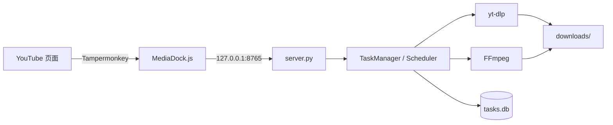

# MediaDock

> 版本 **1.0.0**（用户脚本 `5.2`）｜本地媒体下载与处理平台｜Windows + Python 3.13 + 标准库
>
> MediaDock 在 YouTube 页面放一个下载按钮，把下载任务交给本机 Python 服务：
> yt-dlp 下载、FFmpeg 合并/转音频、SQLite 记录历史，所有页面共享同一份任务列表。



---

## 1. 能做什么

| 能力 | 说明 | 引入阶段 |
| --- | --- | --- |
| 一键下载 | YouTube 页面按钮创建下载任务，默认 1080p MP4 | Stage-001 |
| 多任务 | 最多 3 个并发下载，超出自动排队 | Stage-003 |
| 暂停/继续/取消/重试/删除 | 断点续传，进程可恢复终止 | Stage-004 |
| 共享任务列表 | 所有 YouTube 标签页看到同一份列表与排序 | Stage-003 |
| 持久化与历史 | SQLite `tasks.db`，`/history`、`/events` 可查 | Stage-005 |
| 配置与诊断 | `config.json` + 环境变量 + `--check-config` 依赖诊断 | Stage-006 |
| 本地安全边界 | 只监听 `127.0.0.1`，Host/Origin 校验，路径边界，日志脱敏 | Stage-006 |
| 平台层 | 唯一平台判定入口；首批只支持 YouTube | Stage-007 |
| 清晰度选择 | `/formats` 探测，Best/1080p/720p/480p/仅音频 | Stage-008 |
| 转音频 | 已完成的视频转 MP3/M4A/WAV，同样进任务列表 | Stage-009 |
| 发布与回归 | 一条命令给出发布结论 + 文档 + 回滚路径 | Stage-010 |

---

## 2. 快速开始

```powershell
# 1) 依赖（本机 yt-dlp 与 FFmpeg 需要已安装，见 docs/install.md）
C:\Users\Administrator\Envs\mediadock\Scripts\python.exe -m pip install -r requirements.txt

# 2) 配置检查（不启动服务；退出码 0 = 可用）
C:\Users\Administrator\Envs\mediadock\Scripts\python.exe server.py --check-config

# 3) 启动服务
C:\Users\Administrator\Envs\mediadock\Scripts\python.exe server.py

# 4) 健康检查
curl.exe http://127.0.0.1:8765/health
```

`/health` 会返回版本、存储、配置与依赖四块信息：

```json
{
  "status": "ok",
  "version": { "app": "1.0.0", "api": "1", "userscript": "5.2", "schema": 2 },
  "storage": { "kind": "sqlite", "schema_version": 2, "degraded": false },
  "config": { "source": "file", "ok": true, "errors": [], "warnings": [] },
  "dependencies": { "ok": true, "checks": [] }
}
```

完整步骤、依赖安装与可选开机自启：[docs/install.md](docs/install.md)。

---

## 3. 安装用户脚本

1. 浏览器安装 Tampermonkey。
2. 新建脚本，粘贴 `MediaDock.js` 全文并保存。
3. 打开任意 `youtube.com/watch` 或 `youtube.com/shorts` 页面，右下角出现 MediaDock 面板。

细节与更新方式：[docs/userscript.md](docs/userscript.md)。

---

## 4. HTTP API 一览

| 方法 | 路径 | 用途 |
| --- | --- | --- |
| GET | `/health` | 版本 + 存储 + 配置 + 依赖 |
| GET | `/tasks` | 共享任务列表（契约排序） |
| GET | `/status` | 兼容入口：全量任务 |
| GET | `/status?id=` | 兼容入口：单任务 |
| GET | `/history?limit=&status=` | 终态任务历史 |
| GET | `/events?id=&limit=` | 任务状态事件流 |
| GET | `/formats?url=` | 清晰度探测（Stage-008） |
| GET | `/download?url=&preset=&format_id=` | 创建下载任务 |
| GET | `/audio` | 音频目标列表 |
| POST | `/audio` | 由已完成的下载任务创建音频任务 |
| POST | `/pause` `/resume` `/cancel` `/retry` | 任务控制 |
| POST | `/delete` | 删除终态任务记录 |

错误响应统一为 `{"error_code": "...", "message": "..."}`（必要时带 `task_id`）。
错误码与状态机说明见各阶段文件与 [docs/known-limitations.md](docs/known-limitations.md)。

---

## 5. 配置

优先级：**显式路径 > 环境变量 > `config.json` > 内置默认值**。
复制 `config.example.json` 为 `config.json` 后按需修改，键说明见
[docs/configuration.md](docs/configuration.md)。

---

## 6. 测试与发布检查

```powershell
C:\Users\Administrator\Envs\mediadock\Scripts\python.exe -m unittest discover -s tests -t .
C:\Users\Administrator\Envs\mediadock\Scripts\python.exe tests\release_check.py
C:\Users\Administrator\Envs\mediadock\Scripts\python.exe tests\check_userscript.py
```

- `release_check.py` 是发布门禁：静态检查（文档/版本/配置对齐）+ 运行期检查
  （真实 HTTP 全链路、重启语义、回滚演练、安全守卫），退出码 `0` = 可交付。
- 结果写入 `tests/release_check_result.json`（可直接 diff 复核）。
- 发布与回滚流程：[docs/upgrade-rollback.md](docs/upgrade-rollback.md)、
  [docs/release-checklist.md](docs/release-checklist.md)。

---

## 7. 目录结构

```text
server.py          HTTP 层：路由、请求校验、错误码映射
core_config.py     配置层（唯一真值来源 + 诊断）
core_control.py    任务控制上下文（暂停/取消意图、运行期参数）
core_deps.py       yt-dlp/FFmpeg/Python 依赖诊断
core_engine.py     yt-dlp 下载引擎（argv 唯一构造点）
core_files.py      文件归属、路径边界、临时文件清理
core_formats.py    清晰度预设、探测、选择器拼装
core_listing.py    /tasks 与 /history 载荷、排序契约
core_manager.py    Task 内存模型与状态机
core_media.py      FFmpeg 音频转换（媒体处理任务）
core_parse.py      yt-dlp 进度/合并输出解析
core_platform.py   平台检测与 Adapter 注册表
core_release.py    版本真值与发布静态检查
core_scheduler.py  并发槽位、FIFO 队列、控制编排
core_security.py   Host/Origin/路径/日志脱敏纯函数
core_store.py      SQLite 存储、迁移、事件、清理
core_task.py       Task 数据结构
MediaDock.js       Tampermonkey 用户脚本
docs/              安装、配置、脚本、变更日志、限制、升级回滚、发布清单
tests/             335 个单元测试 + 8 个探针 + JS 结构检查 + 发布检查
```

---

## 8. 已知限制

不支持场景（多平台、字幕、播放列表、安装包、开机自启自动注册等）与
设计上的取舍见 [docs/known-limitations.md](docs/known-limitations.md)。

---

## 9. 文档索引

| 文档 | 内容 |
| --- | --- |
| [docs/install.md](docs/install.md) | 新环境安装、启动、健康检查、可选开机自启 |
| [docs/configuration.md](docs/configuration.md) | 配置键、环境变量、优先级、示例 |
| [docs/userscript.md](docs/userscript.md) | 用户脚本安装、更新、版本一致性 |
| [docs/release-notes.md](docs/release-notes.md) | 变更日志与版本一览 |
| [docs/known-limitations.md](docs/known-limitations.md) | 已知限制与不支持场景 |
| [docs/upgrade-rollback.md](docs/upgrade-rollback.md) | 升级、备份、回滚、降级运行 |
| [docs/release-checklist.md](docs/release-checklist.md) | 发布检查清单、观察窗口、异常升级规则 |
| [docs/stage010-migration.md](docs/stage010-migration.md) | Stage-010 迁移说明 |

阶段化开发过程（Stage-001~010）见根目录 `Stage-0xx.md` 与 `plan-whole.md`。

---

## 10. 许可

见 [LICENSE](LICENSE)。
