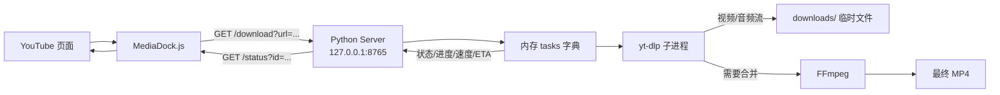
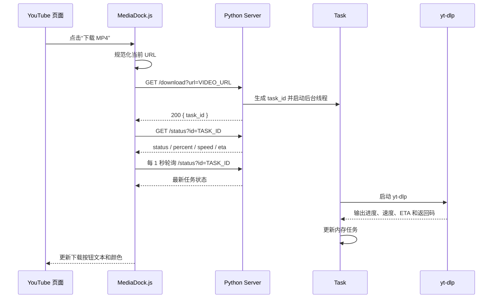
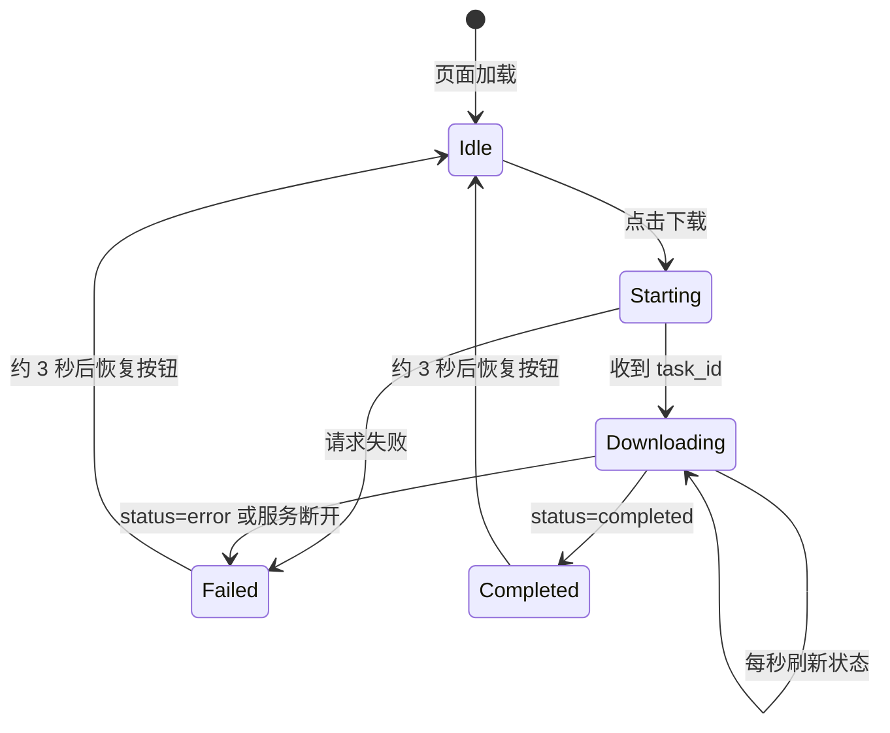

# Stage-001：基线确认与 MVP 稳定化

> 依据：[plan-whole.md](plan-whole.md) `0.2`
>
> 本阶段只确认并稳定现有的 YouTube 单任务 MVP，不实现多任务、暂停、继续、删除、SQLite、平台 Adapter 或动态格式选择。

---

## 1. 阶段元数据

- 阶段编号：`Stage-001`
- 阶段名称：基线确认与 MVP 稳定化
- 总计划版本：`0.2`
- 当前状态：未开始
- 负责人：[待填写]
- 开始时间：[待填写]
- 预计完成时间：[待填写]
- 当前阻塞：[待填写]
- 前置阶段：无
- 后续阶段：`Stage-002` Task 核心模型与后端边界

---

## 2. 阶段目标

确认当前 MediaDock 能够稳定完成以下最小闭环：

```text
YouTube 页面
  -> MediaDock.js 下载按钮
  -> GET /download?url=...
  -> Python Server 创建 task_id
  -> yt-dlp 下载
  -> FFmpeg 合并 MP4
  -> GET /status?id=...
  -> 页面显示百分比、速度、ETA
  -> 显示完成或失败
```

本阶段完成后，需要得到一份可信的现状基线，使 Stage-002 可以在不猜测当前行为的情况下设计 Task 模型和后端边界。

### 2.1 当前 MVP 数据流向



### 2.2 当前 API 请求时序



### 2.3 当前页面显示状态

Stage-001 的页面仍是单任务按钮，不是后续阶段的全局任务列表：



页面显示示意：

```text
空闲：
┌────────────────────┐
│  ⬇ 下载 MP4         │
└────────────────────┘

下载中：
┌────────────────────┐
│  ⏳ 8.8%             │
│  22.68KiB/s         │
│  ETA 47:53          │
└────────────────────┘

合并中：
┌────────────────────┐
│  🔄 合并中 99%      │
└────────────────────┘

完成：
┌────────────────────┐
│  ✅ 下载完成         │
└────────────────────┘

失败或服务不可用：
┌────────────────────┐
│  ❌ 下载失败         │
└────────────────────┘
```

后续 Stage-003 才会将上述单按钮扩展为共享任务列表；本阶段只记录当前显示基线。

---

## 3. 范围边界

### 3.1 本阶段包含

- 检查根目录 `server.py` 和 `MediaDock.js` 当前行为。
- 验证本地服务启动和 `127.0.0.1:8765` 监听。
- 验证 `/health`、`/download`、`/status`。
- 验证 yt-dlp 下载、进度解析和 FFmpeg 合并。
- 建立最小测试基线和测试记录。
- 记录当前 Task 字段、状态、日志、文件和错误行为。
- 记录后续模块拆分边界和已知限制。

### 3.2 本阶段明确不包含

- 同时下载多个任务。
- 最多 3 个并发和等待队列。
- 跨 YouTube 页面共享任务列表。
- 暂停、继续、取消、删除和断点恢复。
- SQLite、下载历史和服务重启后的任务恢复。
- TikTok、X、Instagram 等其他平台。
- `/pause`、`/resume`、`/cancel`、`/delete`、`/retry` 控制 API。
- 4K、动态格式选择、`/formats` 和高级 FFmpeg 参数。
- 大规模重构为 `server/`、`core/`、`adapters/` 目录。

---

## 4. 输入契约

### 4.1 现有文件

| 文件 | 本阶段用途 |
| --- | --- |
| `server.py` | 当前 HTTP Server、Task 内存模型、yt-dlp 子进程和进度解析实现 |
| `MediaDock.js` | 当前 YouTube 下载按钮、API 调用和单任务轮询实现 |
| `MediaDock-server.log` | 服务和下载运行日志，作为问题诊断依据 |
| `plan.md` | 原始 MVP 目标、格式策略和阶段背景 |
| `plan-whole.md` | 当前总计划和后续阶段约束 |

### 4.2 外部依赖

- Windows。
- Python 3。
- 可执行的 `yt-dlp` 或 `yt-dlp.exe`。
- 可执行的 FFmpeg，且 yt-dlp 能调用它完成合并。
- Tampermonkey。
- 可访问且允许测试的 YouTube 视频，或等价的模拟测试输入。

依赖路径不得在本阶段擅自改成新的配置系统；只记录当前解析结果和问题，配置系统属于后续阶段。

---

## 5. 阶段契约

### 5.1 输入

- 当前 `server.py` 和 `MediaDock.js` 实现。
- [plan.md](plan.md) 中确认的 YouTube MP4 MVP 行为。
- [plan-whole.md](plan-whole.md) 中的 API、Task 和安全约束。

### 5.2 本阶段决策

- 保持当前 MVP 默认格式策略：

```text
bv*[height<=1080][ext=mp4]+ba[ext=m4a]/b[height<=1080][ext=mp4]
```

- 保持 `--merge-output-format mp4`。
- 保持本地 API 默认监听 `127.0.0.1:8765`。
- 暂时兼容当前 `GET /download?url=...`，是否新增 POST 创建任务由后续阶段决定。
- 当前服务重启后的能力只描述为“可以重新创建任务”，不能描述为“可以恢复正在运行的任务”。
- 保持单任务 MVP 行为，不在本阶段伪装支持多任务。

### 5.3 输出

- API 和 Task 字段基线快照。
- MVP 端到端测试结果。
- 依赖、错误、日志和文件行为记录。
- 最小自动化测试基线。
- 已知问题、限制和风险清单。
- Stage-002 可直接继承的 Task 和 API 约束。

### 5.4 后续阶段不变约束

- 每次下载都是独立 Task，不能恢复成单一全局 `download_status`。
- Userscript 不直接运行 yt-dlp 或 FFmpeg。
- 后续多任务阶段必须兼容或明确迁移当前 MVP API。
- 当前下载格式策略在没有新决策前不能被后续阶段偷偷改变。
- 本阶段没有验证的行为不能写入后续计划作为已支持能力。

---

## 6. 具体任务

### 任务 001：记录当前实现基线

**涉及文件：** `server.py`、`MediaDock.js`、`plan.md`、`plan-whole.md`

**内容：**

- 记录当前 HTTP 路由、请求方式、响应结构和错误行为。
- 记录 Task 当前字段、初始状态和状态变化方式。
- 记录 yt-dlp 命令、格式选择、输出目录和合并参数。
- 记录 Userscript 的按钮、轮询间隔、单任务变量和 YouTube SPA 行为。
- 记录当前目录结构与未来拆分边界。

**完成标准：**

- [ ] API、Task、文件和日志行为均有快照。
- [ ] 所有快照注明“当前已实现”或“计划中的未实现能力”。
- [ ] 未把多任务、暂停、删除或持久化写成当前能力。

### 任务 002：确认运行环境和依赖

**内容：**

- 确认 Python 版本。
- 确认 `yt-dlp` 实际解析路径和版本。
- 确认 FFmpeg 是否可被 yt-dlp 调用。
- 确认下载目录存在且可写。
- 确认端口 `8765` 可用，服务只监听 `127.0.0.1`。
- 记录依赖缺失时的实际错误。

**建议检查命令：**

```powershell
python --version
where.exe yt-dlp
yt-dlp --version
where.exe ffmpeg
ffmpeg -version
Test-Path .\downloads
Test-NetConnection 127.0.0.1 -Port 8765
```

如果命令不可用，记录实际错误，不要为了通过检查临时修改系统环境而不记录。

### 任务 003：验证静态和最小自动化基线

**内容：**

建立最小测试目录或等价测试脚本，优先覆盖不依赖真实网络的逻辑：

- URL 缺失和 URL 协议校验。
- 任务 ID 生成和任务查询。
- `/status?id=不存在` 的错误行为。
- 进度文本解析，包括普通下载、HLS 分片和合并输出。
- 任务完成、错误和异常分支的状态更新。
- 关键字段的 JSON 可序列化性。

**静态检查：**

```powershell
python -m py_compile .\server.py
```

测试脚本、测试命令和结果必须记录在本文件的执行记录中。

### 任务 004：验证 API 全链路

**启动服务：**

```powershell
python .\server.py
```

服务启动后执行：

```powershell
Invoke-RestMethod http://127.0.0.1:8765/health
Invoke-RestMethod http://127.0.0.1:8765/status
```

使用测试视频创建任务：

```powershell
$url = 'https://www.youtube.com/watch?v=VIDEO_ID'
$encoded = [uri]::EscapeDataString($url)
$created = Invoke-RestMethod "http://127.0.0.1:8765/download?url=$encoded"
$created
```

保存返回的 `task_id`，持续查询：

```powershell
$taskId = $created.task_id
Invoke-RestMethod "http://127.0.0.1:8765/status?id=$taskId"
```

**必须验证：**

- `/health` 返回 HTTP 200 和 `status=ok`。
- 合法 URL 返回唯一 `task_id`。
- 缺少 URL 返回 400。
- 非 HTTP/HTTPS URL 返回 400。
- 不存在的任务返回 404 或当前约定的明确错误结构。
- `/status` 能返回全量任务对象。
- `/status?id=...` 能返回单个任务对象。
- 任务至少能观察到启动、下载中、完成或错误中的一种明确路径。

### 任务 005：验证真实下载和文件结果

**内容：**

使用允许测试的 YouTube URL，验证：

1. 创建任务。
2. 观察 `percent`、`speed`、`eta` 和 `status`。
3. 确认 yt-dlp 使用既定的最高 1080p MP4 策略。
4. 确认需要合并时 FFmpeg 被调用。
5. 确认最终文件出现在 `downloads/` 或当前配置下载目录。
6. 确认任务完成时 `percent=100`、状态为 `completed`。
7. 确认任务失败时状态为 `error`，并能从日志定位原因。
8. 记录 `.part`、`.ytdl` 或分片临时文件的实际行为，但本阶段不实现暂停或删除策略。

**重要说明：**

HLS 分片下载过程中百分比可能回退或重新估算，不能仅因为百分比下降就判定失败；应以进程返回码、最终文件和任务状态为准。

### 任务 006：验证 Userscript 页面行为

**内容：**

在 YouTube 页面安装当前 `MediaDock.js`，验证：

- 页面出现 MediaDock 下载按钮。
- 点击后按钮显示启动、下载中、完成或失败状态。
- 页面每秒轮询 `/status?id=...`。
- 页面显示百分比、速度和 ETA。
- YouTube SPA 导航后按钮仍存在。
- 服务不可用时页面显示明确错误。
- 当前实现只跟踪一个 `currentTaskId`，该限制被记录为 Stage-003 的改造输入。

本任务不要求实现任务列表、跨页面同步或多个按钮。

### 任务 007：整理已知问题和迁移边界

至少记录：

- `server.py` 将 HTTP、Task、下载和进度解析集中在一起。
- 当前任务只保存在内存，服务重启后记录消失。
- 当前只支持单任务前端状态。
- 当前没有暂停、继续、取消和删除 API。
- 当前日志可能包含完整 URL 或命令信息。
- 当前错误响应格式仍需统一。
- 当前配置路径仍在代码中。
- 当前没有全量独立测试目录或测试命令标准。

---

## 7. 测试计划

### 7.1 测试矩阵

| 编号 | 场景 | 类型 | 预期结果 |
| --- | --- | --- | --- |
| T001 | Python 语法检查 | 静态 | `py_compile` 通过 |
| T002 | yt-dlp/FFmpeg 存在 | 环境 | 路径和版本可记录 |
| T003 | `/health` | API | 200，JSON `status=ok` |
| T004 | 合法 `/download` | API | 返回唯一 `task_id` |
| T005 | 缺少 URL | API | 400，错误明确 |
| T006 | 非法 URL | API | 400，错误明确 |
| T007 | 查询全量任务 | API | 返回任务集合 |
| T008 | 查询单任务 | API | 返回对应任务 |
| T009 | 查询不存在任务 | API | 404 或统一错误 |
| T010 | 进度解析 | 单元 | 普通/HLS/合并输出可处理 |
| T011 | 真实 YouTube 下载 | 集成 | 完成或明确错误 |
| T012 | MP4 合并 | 集成 | 最终文件存在且可播放或可识别 |
| T013 | 失败依赖 | 集成 | `error` 和日志原因明确 |
| T014 | Userscript 按钮 | 手工 | 创建任务并显示状态 |
| T015 | SPA 导航 | 手工 | 按钮保持可用 |
| T016 | 服务重启 | 回归 | 可重新创建任务；不声称恢复旧进程 |

### 7.2 测试记录要求

每个测试记录：

- 执行日期和环境。
- 使用的 URL 或模拟输入类型；敏感 URL 可脱敏。
- 实际命令或操作。
- 实际结果。
- 通过/失败/阻塞。
- 失败日志位置。
- 是否影响后续阶段。

真实网络、YouTube、yt-dlp 或 FFmpeg 不可用时，不能标记全链路通过；应分别标记未执行项，并用模拟测试补足可测试的局部逻辑。

---

## 8. 阶段验收标准

### 8.1 功能验收

- [ ] `/health` 返回 HTTP 200 和 JSON `status=ok`。
- [ ] 合法 URL 能创建任务并返回唯一 `task_id`。
- [ ] `/status` 能查询全量任务。
- [ ] `/status?id=...` 能查询指定任务。
- [ ] 页面能够显示下载中的百分比、速度和 ETA。
- [ ] 下载成功时能生成最终 MP4 并显示 `completed`。
- [ ] 下载失败时显示 `error`，并能定位错误原因。

### 8.2 兼容性验收

- [ ] 保持 `127.0.0.1:8765`。
- [ ] 保持当前 `GET /download?url=...`。
- [ ] 保持 `/health`、`/status` 的当前可用行为，除非记录了兼容变更。
- [ ] 不改变 MVP 默认格式选择和 MP4 合并策略。
- [ ] Windows 环境可启动服务并写入下载目录。

### 8.3 质量与安全验收

- [ ] `python -m py_compile .\server.py` 通过。
- [ ] URL 协议校验测试通过。
- [ ] 不默认监听 `0.0.0.0`。
- [ ] 依赖缺失时不会伪造成功状态。
- [ ] 已记录日志、路径和完整 URL 可能带来的安全风险。
- [ ] 已知限制没有写成已实现能力。

### 8.4 阶段完成影响检查

**对前置阶段：**

- [ ] 本阶段无前置阶段。
- [ ] 已确认当前代码实际行为与 `plan.md` 和 `plan-whole.md` 的 MVP 目标差异。

**对后续阶段：**

- [ ] 已向 Stage-002 输出 Task 字段、状态、API 和错误行为快照。
- [ ] 已明确 Stage-002 不能继续依赖单一 `currentTaskId` 作为全局任务模型。
- [ ] 已明确 Stage-003 需要重做任务列表和跨页面同步。
- [ ] 已记录所有需要回归的 MVP API。
- [ ] 如果本阶段发现 API、Task 或格式策略需要改变，已先更新 `plan-whole.md` 和本文件版本。

**进入下一阶段条件：**

- [ ] 所有高影响决策已确认，或已明确记录保守假设。
- [ ] 核心测试结果已记录。
- [ ] 阻塞项已有处理决定。
- [ ] 允许生成 `Stage-002.md`。

---

## 9. 风险、依赖与回滚

### 9.1 风险

| 风险 | 影响 | 缓解措施 |
| --- | --- | --- |
| YouTube 或网络不可用 | 无法完成真实下载验证 | 使用模拟进度解析测试，并记录真实链路未执行 |
| yt-dlp 输出格式变化 | 进度和标题解析失效 | 保存原始日志，增加解析单元测试 |
| FFmpeg 缺失 | 无法合并音视频 | 启动前检查并明确报告依赖错误 |
| HLS 百分比回退 | UI 误判下载失败 | 以进程结果和最终状态判断，不强制百分比单调 |
| 下载文件名含特殊字符 | 日志或文件处理异常 | 记录当前行为，路径安全在 Stage-006 加固 |
| 测试改动破坏 MVP | 后续阶段基线失真 | 每次改动后执行 API 和 Userscript 回归 |

### 9.2 外部依赖

- Windows 进程和文件权限。
- Python 解释器。
- yt-dlp 可执行文件和版本。
- FFmpeg 可执行文件。
- YouTube 网络访问。
- 浏览器和 Tampermonkey。

### 9.3 回滚策略

本阶段原则上以测试和记录为主，不进行大规模架构迁移。

如果必须修改代码：

1. 先保留当前可运行版本。
2. 每次只修改一个局部行为。
3. 修改后重新执行 API 和端到端基线。
4. 如果基线失败，恢复本次局部修改，不改变其他用户已有文件。
5. 将无法安全回滚的变更列为阻塞，不进入 Stage-002。

---

## 10. 实际输出与计划差异

开发完成后填写：

- 原计划输出：MVP 基线测试、API/Task 快照、失败场景、Stage-002 输入契约。
- 实际输出：[待填写]
- 差异：[无或具体差异]
- 差异影响：[范围/时间/质量/前置阶段/后续阶段]
- 处理决定：[接受差异/补充任务/回溯阶段/取消需求]

---

## 11. 执行记录

| 日期 | 任务 | 负责人 | 状态 | 执行内容 | 验证结果 | 阻塞/遗留问题 |
| --- | --- | --- | --- | --- | --- | --- |
| [YYYY-MM-DD] | [任务编号] | [角色] | 未开始/进行中/阻塞/完成 | [内容] | [通过/失败/未执行] | [问题] |

---

## 12. 阶段结束签字

- 阶段状态：未开始/进行中/阻塞/已完成/已取消
- 阶段验收结论：[允许/不允许进入 Stage-002]
- 对前置阶段影响：[无/具体影响]
- 对后续阶段影响：[无/具体影响]
- 是否更新 `plan-whole.md`：[是/否，版本]
- 审查人：[待填写]
- 日期：[待填写]
