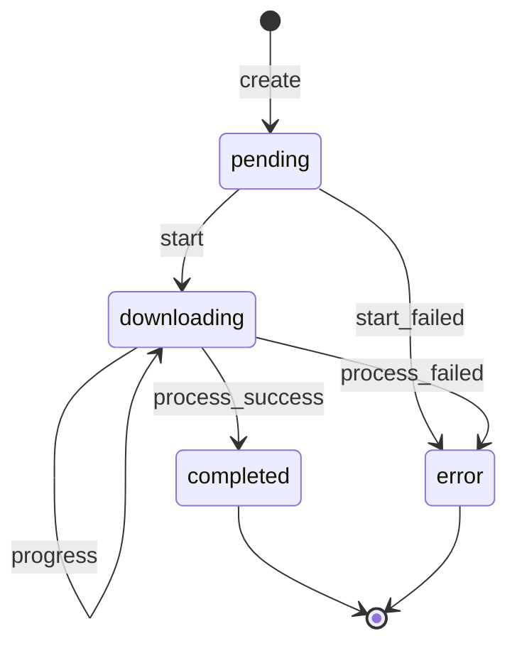

# Stage-002：Task 核心模型与后端边界

> 依据：[plan-whole.md](plan-whole.md) `0.2`、[Stage-001.md](Stage-001.md) 和 [docs/stage001-baseline.md](docs/stage001-baseline.md)
>
> 本阶段在不破坏 Stage-001 YouTube 单任务 MVP 的前提下，固化 Task 数据模型、基础状态机和后端模块责任。多任务调度、暂停/继续/取消、SQLite 持久化、平台 Adapter 和动态格式选择分别属于后续阶段。

---

## 1. 阶段元数据

- 阶段编号：`Stage-002`
- 阶段名称：Task 核心模型与后端边界
- 总计划版本：`0.2`
- 当前状态：已完成
- 负责人：Cline
- 开始时间：2026-09-19
- 预计完成时间：2026-09-19
- 当前阻塞：无；T015（SPA 导航）遗留 Stage-003
- 前置阶段：`Stage-001` 基线确认与 MVP 稳定化
- 后续阶段：`Stage-003` 多任务调度

---

## 2. 阶段目标

将当前 `server.py` 中混合的任务字典、状态更新和下载线程行为，收敛为可测试、可替换的后端核心边界：

```text
HTTP Handler
  -> TaskManager
      -> Task 模型和状态转换
      -> DownloadEngine
          -> yt-dlp 子进程
          -> ProgressParser
      -> 内存 TaskStore
```

本阶段完成后，后续阶段可以在不重新定义 Task 字段和状态规则的情况下加入任务队列、控制操作和持久化。

### 2.1 本阶段成功标准

- Task 字段、默认值、时间字段和序列化结构固定，并与 `plan-whole.md` 兼容。
- 状态转换只能通过 TaskManager 或统一状态转换函数执行，HTTP Handler 不直接修改任务状态。
- 当前 MVP 下载流程仍能创建任务、更新进度并进入 `completed` 或 `error`。
- `/health`、`/download`、`/status` 继续可用；现有 Userscript 无需修改即可轮询任务。
- 进度解析、Task 状态转换、任务查询和 API 错误响应可以独立测试。
- 模块拆分有明确回滚路径，不引入 SQLite、队列调度或控制 API。

---

## 3. 范围边界

### 3.1 本阶段包含

- 定义 Task 的 Python 数据结构和 JSON 序列化结果。
- 定义 Stage-002 范围内的状态集合和合法转换。
- 实现线程安全的内存 TaskStore/TaskManager 边界。
- 抽离 yt-dlp 命令构造和子进程执行边界。
- 抽离进度、合并和标题输出解析边界。
- 统一后端内部错误表示，并逐步统一 API 错误 JSON。
- 保持现有 MVP API 和默认下载格式策略。
- 为核心模型、状态机、模块边界和 API 回归补充测试。
- 记录迁移、回滚和对 Stage-003 的输出契约。

### 3.2 本阶段明确不包含

- 多任务并发上限、等待队列和任务列表 UI；属于 Stage-003。
- 暂停、继续、取消、删除、重试和断点恢复；属于 Stage-004。
- SQLite、任务历史、服务重启恢复；属于 Stage-005。
- `config.json`、依赖诊断和完整日志脱敏加固；主要属于 Stage-006。
- TikTok、X、Instagram 等平台 Adapter；属于 Stage-007。
- `/formats`、动态格式选择和高级 FFmpeg 参数；属于 Stage-008。
- 音频模式和统一 Media Processor；属于 Stage-009。
- Userscript 任务列表、多页面同步和跨页面控制。
- 改变 `height<=1080` MP4 默认格式表达式。

---

## 4. 输入契约

### 4.1 Stage-001 已确认输入

- 服务默认监听 `127.0.0.1:8765`。
- 现有 API 为 `GET /health`、`GET /download?url=...`、`GET /status` 和 `GET /status?id=...`。
- `GET /download` 必须继续兼容现有 Userscript。
- 当前任务保存在内存，服务重启后任务消失；本阶段不能声称支持恢复。
- 当前 Task 已有 `status`、`percent`、`speed`、`eta`、`url`、`title`、`created_at`、`updated_at` 等字段。
- 当前真实下载流程已验证，默认 yt-dlp 格式为：

```text
bv*[height<=1080][ext=mp4]+ba[ext=m4a]/b[height<=1080][ext=mp4]
```

- 当前进度解析覆盖普通下载、HLS 风格输出和合并输出；HLS 百分比不要求单调递增。
- 当前错误响应存在文本/JSON 不一致，这是本阶段需要收敛的兼容性问题。

### 4.2 代码入口

| 当前入口 | Stage-002 处理 |
| --- | --- |
| `server.py` | 保留启动入口，逐步转为组装 HTTP Handler 与核心对象 |
| `tests/test_baseline.py` | 保留进度解析回归，改为测试新的解析模块或兼容导出 |
| `tests/test_api.py` | 保留 API 回归，增加 TaskManager 与状态机测试 |
| `MediaDock.js` | 本阶段不改协议；继续使用 `GET /download` 和 `/status` |
| `docs/stage001-baseline.md` | 作为迁移前快照，不覆盖已验证事实 |

---

## 5. 阶段契约

### 5.1 Task 模型

Task 至少包含以下字段，字段名必须稳定：

```json
{
  "task_id": "a82f31c4",
  "type": "download",
  "status": "pending",
  "url": "https://www.youtube.com/watch?v=...",
  "platform": "youtube",
  "title": "",
  "percent": 0.0,
  "speed": "",
  "eta": "",
  "file_path": "",
  "error_code": "",
  "error_message": "",
  "created_at": "",
  "started_at": "",
  "updated_at": "",
  "completed_at": "",
  "completion_order": null
}
```

规则：

- 创建任务时 `status=pending`，`percent=0.0`，字符串字段使用空字符串，时间字段使用可序列化的 ISO 字符串。
- 开始执行时写入 `started_at` 并转为 `downloading`。
- 成功时写入 `completed_at`、`file_path`（若能可靠取得），设置 `percent=100.0` 并转为 `completed`。
- 失败时转为 `error`，至少写入 `error_code` 或 `error_message`，不得伪造 `completed`。
- `url` 在 API 返回和日志脱敏问题未解决前，继续遵守 Stage-001 的既有行为；本阶段不扩大日志暴露面。
- 对外返回的是副本或序列化结果，调用方不能通过修改返回对象直接改变内存任务。

### 5.2 Stage-002 状态机

本阶段只实现已经有后端行为和测试证据的基础路径：



以下状态可以在模型或迁移文档中预留，但本阶段不得伪装为可用状态或提供对应 API：`paused`、`cancelled`。

非法转换必须返回明确的业务错误，不应静默修改状态。`completed` 和 `error` 为终态，重试逻辑留给 Stage-004/005 的决策。

### 5.3 模块责任边界

| 模块 | 责任 | 不负责 |
| --- | --- | --- |
| `Task` | 字段、默认值、序列化和基础不变量 | HTTP、线程启动、直接运行命令 |
| `TaskManager` | 创建、查询、状态转换、进度更新和线程安全 | 解析 HTTP 参数、拼接页面 UI |
| `TaskStore` | 当前进程内保存和读取 Task | SQLite、重启恢复、历史分页 |
| `DownloadEngine` | 构造并运行受控 yt-dlp 进程，报告事件 | 决定 HTTP 状态码、直接修改 Task 字典 |
| `ProgressParser` | 将 yt-dlp 输出转换为进度/合并/标题事件 | 保存任务、改变终态 |
| `Handler` | 参数校验、调用 TaskManager、JSON 响应和 HTTP 状态码 | 直接操作 `tasks` 或解析 yt-dlp 输出 |
| `Config` | 提供当前下载目录、yt-dlp 路径和格式常量 | 动态配置文件和依赖安装 |

模块命名可根据实际实现调整，但责任边界和公开契约不能无记录改变。

### 5.4 API 兼容契约

- 保持 `GET /health` 返回 200 和 `{"status":"ok"}`。
- 保持 `GET /download?url=...` 返回 200 和 `{"task_id":"..."}`。
- 保持 `GET /status` 返回全量任务对象；Stage-002 可增加字段，但不能删除 Stage-001 已有字段。
- 保持 `GET /status?id=...` 返回单个任务；未知任务继续返回 404。
- 缺失 URL、协议非法、任务不存在和非法状态操作应返回 JSON 错误，至少包含 `error_code` 和 `message`。
- 如果为兼容现有调用方暂时保留文本错误，必须在测试和执行记录中说明；推荐本阶段直接统一为 JSON，因为当前 Userscript 只依赖 HTTP 失败状态。
- 本阶段不新增 `/pause`、`/resume`、`/cancel`、`/retry`、`/formats`。

---

## 6. 具体任务

### 任务 001：冻结 Task 字段和不变量

**涉及文件：** 新增核心模型模块、`server.py`、`tests/`

**内容：**

- 选择标准库数据结构实现 Task，例如 `dataclass`，避免引入新运行时依赖。
- 定义字段默认值、时间生成、任务 ID 生成和 JSON 序列化。
- 明确百分比范围、状态名称和错误字段规则。
- 兼容旧任务字典读取，或在迁移期间提供等价字段映射。

**完成标准：**

- [ ] 新建 Task 时可生成完整契约字段。
- [ ] `json.dumps()` 可以序列化对外 Task。
- [ ] 返回副本不会修改内部对象。
- [ ] 旧 API 字段全部仍可查询。

### 任务 002：实现状态转换和 TaskManager

**涉及文件：** Task 模型、TaskManager/TaskStore 模块、`server.py`、`tests/`

**内容：**

- 实现创建、查询单个、查询全部和删除内部记录的最小存储接口；本阶段不提供删除 HTTP API。
- 实现 `pending -> downloading -> completed/error` 转换。
- 所有更新统一刷新 `updated_at`。
- 在锁或等价线程安全机制下保证读取和更新不会产生半更新对象。
- 为非法转换返回明确异常或业务错误。

**完成标准：**

- [ ] Handler 不再直接写入全局任务字典。
- [ ] 下载线程通过 TaskManager 更新进度和最终状态。
- [ ] 并发读写测试不产生不可序列化或字段缺失的结果。
- [ ] Stage-001 的内存任务行为仍能回归通过。

### 任务 003：抽离 ProgressParser

**涉及文件：** 新增解析模块、`tests/test_baseline.py` 或新的解析测试

**内容：**

- 将普通下载进度、HLS 输出、合并输出、Destination 行和标题识别从 HTTP/下载控制流中抽离。
- 使用明确的事件或结果结构向 DownloadEngine 报告，不直接修改 Task。
- 保留当前 `PROGRESS_RE`、`MERGE_RE` 的可测试行为，必要时提供兼容导出。
- 对异常、空行和未知 yt-dlp 输出保持忽略或可诊断行为。

**完成标准：**

- [ ] 现有进度解析测试通过。
- [ ] 普通下载、HLS、合并和标题事件均有单元测试。
- [ ] 解析器不依赖全局 `tasks` 或 HTTP Handler。
- [ ] 百分比回退不会被解析器误报为任务失败。

### 任务 004：抽离 DownloadEngine 和命令构造

**涉及文件：** 新增下载引擎模块、配置/常量模块、`server.py`、`tests/`

**内容：**

- 将 yt-dlp 命令列表构造独立为可测试函数。
- 保持当前格式表达式、`--merge-output-format mp4`、`--newline`、`--no-playlist`、下载目录参数。
- 将子进程启动、输出读取、返回码判断和异常归入 DownloadEngine。
- 通过事件回调或 TaskManager 接口反馈进度、标题、合并和完成/失败结果。
- 保留 Windows `CREATE_NO_WINDOW` 行为。

**完成标准：**

- [ ] 命令构造测试确认关键参数顺序和内容。
- [ ] 假 yt-dlp 可以覆盖成功、非零返回码和 `FileNotFoundError`。
- [ ] DownloadEngine 不直接依赖 HTTP 请求对象。
- [ ] 成功和失败状态均由 TaskManager 统一写入。

### 任务 005：收敛 Handler 和错误响应

**涉及文件：** `server.py` 或 API 模块、`tests/test_api.py`

**内容：**

- 让 Handler 只负责 URL 解析、输入校验、调用 TaskManager 和返回响应。
- 统一错误结构，例如：

```json
{
  "error_code": "invalid_url",
  "message": "URL must use http or https"
}
```

- 保留现有成功响应和 HTTP 状态码兼容行为。
- 明确任务创建后线程启动失败时的状态和 API 行为。
- 不在本阶段引入 POST 创建任务，以免扩大 Userscript/API 迁移范围。

**完成标准：**

- [ ] 缺少 URL、非法协议和未知任务均有稳定 JSON 错误结构。
- [ ] `/health`、`/download`、`/status` 回归测试通过。
- [ ] Handler 不再解析 yt-dlp 输出或直接操作任务内部字段。
- [ ] 未知路径和 CORS 行为没有无记录变化。

### 任务 006：迁移兼容与文档

**涉及文件：** `server.py`、`tests/`、`docs/`、`Stage-002.md`

**内容：**

- 保留 `python server.py` 启动方式。
- 保留 Stage-001 的 Userscript 调用方式和默认端口。
- 记录新模块路径、公开函数、兼容导出和已知临时适配代码。
- 更新阶段执行记录、实际输出和计划差异。
- 在迁移完成后删除无调用方的旧全局实现，或明确标记其兼容用途；不保留两套会产生分叉行为的状态机。

**完成标准：**

- [ ] 从根目录启动服务仍可用。
- [ ] Stage-001 测试和 Stage-002 新测试全部通过。
- [ ] 文档能够让 Stage-003 直接使用 TaskManager 查询和创建接口。
- [ ] 未把后续阶段能力写成当前已实现能力。

---

## 7. 测试计划

### 7.1 测试矩阵

| 编号 | 场景 | 类型 | 预期结果 |
| --- | --- | --- | --- |
| T201 | Task 默认字段 | 单元 | 字段完整，默认值正确 |
| T202 | Task JSON 序列化 | 单元 | 可序列化且字段稳定 |
| T203 | Task 返回副本 | 单元 | 外部修改不影响存储 |
| T204 | 合法状态转换 | 单元 | pending/downloading/completed/error 路径通过 |
| T205 | 非法状态转换 | 单元 | 返回明确业务错误，状态不变 |
| T206 | 并发读写 | 单元 | 无半更新、异常或数据损坏 |
| T207 | 进度解析回归 | 单元 | 普通/HLS/合并/标题事件正确 |
| T208 | yt-dlp 命令构造 | 单元 | 保持既定格式和 MP4 参数 |
| T209 | 假引擎成功 | 集成 | 任务最终为 completed |
| T210 | 假引擎失败 | 集成 | 任务最终为 error 且有错误信息 |
| T211 | 依赖缺失 | 集成 | 不伪造成功，错误可诊断 |
| T212 | `/health` 回归 | API | 200，`status=ok` |
| T213 | `/download` 回归 | API | 合法 URL 返回 task_id |
| T214 | 输入错误响应 | API | 400，JSON 包含 error_code/message |
| T215 | `/status` 回归 | API | 全量和单任务字段兼容 |
| T216 | Stage-001 全量测试 | 回归 | 原有测试全部通过 |
| T217 | 启动与真实失败链路 | 集成 | 根目录启动和失败路径可观察 |

### 7.2 建议命令

```powershell
python -m py_compile .\server.py
python -m unittest discover -s tests -v
python tests/probe_chain.py
```

如果新增模块，必须对新增文件执行语法检查；推荐仍使用标准库测试，不新增未必要的第三方依赖。

### 7.3 验证重点

- 先运行 Task/状态机/解析器单元测试，再运行 API 和假引擎链路。
- 每次模块迁移后运行 Stage-001 全量回归，不以单个新测试通过替代回归。
- 至少执行一次服务重启后的“重新创建任务”检查；只能确认重新创建，不验证旧任务恢复。
- 真实 YouTube 下载继续作为集成回归，不因本阶段模块拆分自动视为重新验证通过。

---

## 8. 阶段产物

- Task 模型和序列化实现。
- TaskStore/TaskManager 内存实现。
- 状态转换规则和非法转换错误。
- ProgressParser 独立实现及测试。
- DownloadEngine 与命令构造边界。
- 保持兼容的 HTTP Handler/API 入口。
- Stage-001 回归测试和 Stage-002 新测试结果。
- 模块边界、迁移路径和回滚说明。
- 本文件中的执行记录、实际输出和影响检查。

---

## 9. 风险、依赖与回滚

### 9.1 风险

| 风险 | 影响 | 缓解措施 |
| --- | --- | --- |
| 拆分后状态更新路径分叉 | 进度或终态不一致 | 只保留一个 TaskManager 状态写入口，并用假引擎覆盖成功/失败 |
| 旧测试依赖 `server.py` 全局符号 | 导入失败或行为改变 | 提供短期兼容导出，迁移完成后再评估删除 |
| API 错误 JSON 改变 | 调用方解析差异 | 保持 HTTP 状态码，新增字段只在错误体；执行 Userscript 回归 |
| 线程启动时序变化 | 查询时看不到任务或出现竞态 | 先创建 pending Task，再启动线程；用并发测试验证 |
| yt-dlp 输出格式变化 | 进度显示异常 | 保留原始日志，解析器独立测试并允许未知行安全忽略 |
| 过早引入未来状态 | UI 或 API 暗示未实现能力 | Stage-002 只开放四条基础状态路径 |

### 9.2 外部依赖

- Windows Python 3 环境。
- Stage-001 已确认的 yt-dlp 和 FFmpeg。
- 标准库线程、HTTP 和子进程能力。
- `downloads/` 可写目录。
- Stage-001 测试和假 yt-dlp 探针。

### 9.3 回滚策略

1. 在拆分前保存 Stage-001 可运行基线和测试结果。
2. 每次只迁移一个责任边界，迁移后运行对应单元测试和全量回归。
3. 保持 `python server.py`、旧 API 路径和兼容导出，直到新路径完成验收。
4. 若 API 或真实下载回归失败，恢复到上一个已验证的模块迁移点，不修改 Stage-001 快照。
5. 若无法同时满足新边界与 MVP 兼容，暂停后续拆分，记录冲突和修订方案，不进入 Stage-003。

---

## 10. 阶段验收标准

### 10.1 功能验收

- [x] Task 模型包含总计划要求的核心字段并可 JSON 序列化。
- [x] 任务创建先进入 `pending`，下载开始后进入 `downloading`。
- [x] 下载成功进入 `completed`，失败进入 `error`，错误信息可定位。
- [x] 进度、速度、ETA、标题和合并事件仍能更新任务。
- [x] 任务查询返回稳定字段副本。

### 10.2 API 兼容验收

- [x] `/health`、`/download`、`/status` 和单任务查询保持可用。
- [x] `MediaDock.js` 不需要因本阶段重构修改调用协议。
- [x] 监听地址仍为 `127.0.0.1:8765`。
- [x] 默认下载格式和 MP4 合并参数不变。
- [x] 输入错误和不存在任务的 JSON 错误结构已记录并通过测试。

### 10.3 质量验收

- [x] `python -m unittest discover -s tests -v` 通过（42/42）。
- [x] `python -m py_compile` 覆盖所有新增或修改的 Python 文件并通过。
- [x] 假引擎成功、失败和依赖缺失路径均通过。
- [x] 没有 Handler 直接修改 Task 内部存储的路径。
- [x] 没有新增未声明的第三方依赖（stdlib only）。
- [x] 没有把多任务调度、控制、持久化或恢复写成已实现能力。

### 10.4 进入 Stage-003 的条件

- [x] Task 字段和状态机已冻结，后续变更有影响评估。
- [x] TaskManager 提供创建、查询全量、查询单个和状态/进度更新边界。
- [x] Stage-001 全量回归通过。
- [x] 模块拆分和兼容导出路径已记录。
- [x] 任务列表排序所需的 `completed_at`、`completion_order` 等字段已具备或有明确补充计划。
- [x] 阶段完成影响检查已完成。

---

## 11. 阶段衔接检查

### 11.1 对 Stage-001 的影响

- 不改变 Stage-001 已确认的 YouTube MVP 目标。
- 不改变默认格式策略、监听地址和现有成功 API。
- API 错误体从文本统一为 JSON 属于兼容性改善；必须保留 HTTP 状态码并更新回归证据。
- 如果迁移导致 Stage-001 任一测试或真实下载行为变化，必须先修复或重新验收，不能直接进入 Stage-003。

### 11.2 对 Stage-003 的输出

- Stage-003 使用 TaskManager 管理多个独立 Task，而不是复制 `currentTaskId` 或直接访问全局字典。
- Stage-003 可在 TaskManager 上增加并发限制和等待队列，但不得重定义 Task 字段或绕过状态机。
- 全量任务查询应从 TaskManager 读取，排序和容量规则由 `plan-whole.md` 继续约束。

### 11.3 对后续阶段的不变约束

- Userscript 不直接运行 yt-dlp 或 FFmpeg。
- 持久化层替换 TaskStore 时必须兼容本阶段 Task 序列化结构。
- 暂停、继续、取消和重试必须通过状态机扩展并记录合法转换，不能直接改字符串状态。
- 平台 Adapter 和动态格式选择不能污染 TaskManager 的通用生命周期。

---

## 12. 执行记录

| 日期 | 任务 | 负责人 | 状态 | 执行内容 | 验证结果 | 阻塞/遗留问题 |
| --- | --- | --- | --- | --- | --- | --- |
| 2026-09-19 | 阶段准备 | Cline | 完成 | 核对 Stage-001 快照、测试和基线入口；Stage-001 已签字完成 | 通过 | 无 |
| 2026-09-19 | 任务 001/002 | Cline | 完成 | 新增 `core_task.py`（Task 模型/序列化/legacy 视图）、`core_manager.py`（TaskManager + pending/downloading/completed/error 状态机 + 并发安全）；`tests/test_task.py`、`tests/test_manager.py` 全过 | 通过 | 无 |
| 2026-09-19 | 任务 003/004 | Cline | 完成 | 新增 `core_parse.py`（纯解析事件）、`core_engine.py`（命令构造 + 子进程执行 + 事件回写）；`tests/test_engine.py` 覆盖成功/失败/缺依赖/标题/合并 | 通过 | 无 |
| 2026-09-19 | 任务 005/006 | Cline | 完成 | `server.py` 改为组装入口：Handler 只做校验 + 调 TaskManager + JSON 响应；错误统一为 `{error_code,message}`（T214）；`GET /download` 保持兼容并先建 pending 再起线程；旧解析循环已删除；新增 `tests/test_apiv2.py` | 通过 | 文本错误改为 JSON 属于兼容改善，HTTP 状态码不变 |
| 2026-09-19 | 全量回归 | Cline | 完成 | `unittest discover -s tests -v` 42/42 通过（含 Stage-001 旧测试 + Stage-002 新测试） | 通过 | Stage-001 旧 `test_api.py` 中 completed→error 断言已按终态语义更新 |
| 2026-09-19 | 收尾验证 | Cline | 完成 | 修掉 `core_engine.py` 未定义 `IllegalState` except 分支；`py_compile` 5 文件通过；重跑 42/42 通过；`probe_chain.py` 失败链路 error 可观测；新增 `docs/stage002-migration.md`；删 `run_verify.py`/`check_stage002.py` | 通过 | T015（SPA 导航）仍遗留 Stage-003 |

---

## 13. 实际输出与计划差异

开发完成后填写：

- 原计划输出：Task 模型、基础状态机、TaskManager、ProgressParser、DownloadEngine 边界和 API 回归。
- 实际输出：`core_task.py`、`core_manager.py`、`core_parse.py`、`core_engine.py`；`server.py` 组装化；`tests/test_task.py`、`test_manager.py`、`test_engine.py`、`test_apiv2.py`；42/42 通过；`docs/stage002-migration.md`。
- 差异：错误体由文本统一为 JSON（HTTP 状态码不变，属兼容改善）；Stage-001 旧测试 completed→error 断言按终态语义更新；`core_engine.py` 收尾时删掉未定义 `IllegalState` 分支。
- 差异影响：Userscript 只依赖 HTTP 状态码，无需修改；终态不可再转属 Stage-002 冻结语义，后续重试需经状态机扩展。
- 处理决定：接受差异，不回溯计划版本；T015 仍遗留 Stage-003。

---

## 14. 阶段完成签字

- 阶段状态：已完成
- 阶段验收结论：允许进入 Stage-003
- 对 Stage-001 影响：MVP 目标/格式/监听地址/成功 API 不变；错误体文本→JSON（状态码不变）；旧测试按终态语义更新一处断言
- 对 Stage-003 影响：使用 TaskManager 管理多任务，不得重定义字段或绕过状态机；`completed_at`/`completion_order` 已就绪；T015 留给任务列表重做时验证
- 是否更新 `plan-whole.md`：是，阶段总览 Stage-002 完成时间填 2026-09-19
- 审查人：用户
- 日期：2026-09-19
