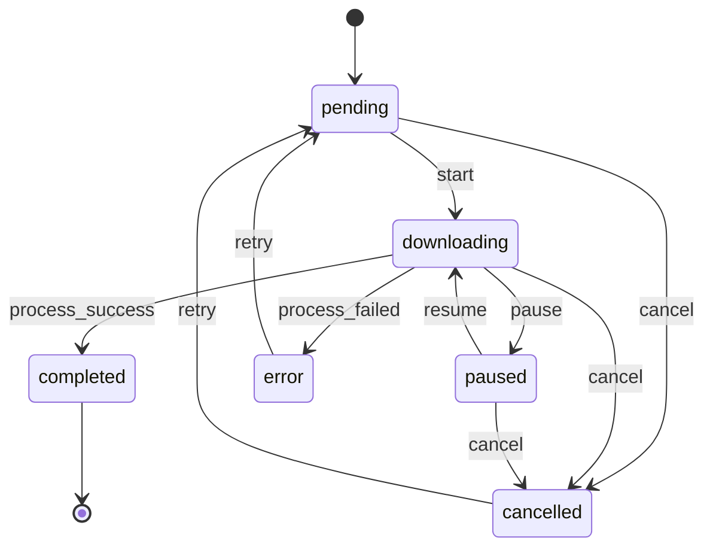

# Stage-004：暂停、继续、取消与断点

> 依据：[plan-whole.md](plan-whole.md) `0.2`、[Stage-003.md](Stage-003.md)、[docs/stage003-migration.md](docs/stage003-migration.md)
>
> 本阶段在已冻结的 Task 模型、Scheduler 活动和 FIFO 队列之上，实现围绕 yt-dlp 子进程的**真实控制**：暂停、继续、取消、重试，以及临时文件和输出文件的保留/删除策略。SQLite 持久化、服务重启恢复、配置系统和平台 Adapter 不属于本阶段。

---

## 1. 阶段元数据

- 阶段编号：`Stage-004`
- 阶段名称：暂停、继续、取消与断点
- 总计划版本：`0.2`
- 当前状态：已完成
- 负责人：Cline
- 开始时间：2026-09-19
- 预计完成时间：2026-09-19
- 当前阻塞：无
- 前置阶段：`Stage-003` 多任务调度与共享任务列表（已完成）
- 后续阶段：`Stage-005` 持久化与任务历史

---

## 2. 阶段目标

把「任务只能开始和结束」升级为「任务可在运行中被用户真实控制」：

```text
Userscript 行内按钮
   |
   v
POST /pause  /resume  /cancel  /retry
   |
   v
Scheduler (活动槽位 + 队列 + 一次性运行记录)
   |
   v
TaskControl（每任务控制上下文：进程句柄 + 暂停/取消标志 + 产物清单）
   |
   v
DownloadEngine -> yt-dlp 子进程（Windows 进程树终止）
   |
   v
Downloads（.part/.ytdl 保留用于断点；取消时清理临时与本次输出）
```

### 2.1 本阶段成功标准

- 状态机扩展出 `paused` 和 `cancelled`，并允许 `error`/`cancelled` 重试；所有转换仍只经过 `TaskManager`。
- `downloading` 可被真实暂停为 `paused`：yt-dlp 进程被终止，`.part`/`.ytdl` 临时文件保留。
- `paused` 可继续为 `downloading`，且复用已有临时数据，不从零开始。
- `downloading`/`paused`/`pending` 可取消为 `cancelled`，绝不错误显示 `completed`。
- 取消会清理该任务本次运行产生的临时文件和输出文件；暂停/继续不删除临时数据。
- 控制操作只作用于目标 `task_id`，不影响其他任务的活动槽位和状态。
- 暂停和取消会释放活动槽位并触发队列补位，并发上限仍为 3。
- Userscript 行内出现暂停/继续/取消/重试按钮，按钮可见性**完全由服务端状态决定**。
- 服务重启后仍不恢复任务，也不恢复暂停/队列；持久化留给 Stage-005。

---

## 3. 范围边界

### 3.1 本阶段包含

- 扩展 `TaskManager` 状态机：`paused`、`cancelled`，以及 `error -> pending`、`cancelled -> pending` 重试。
- 新增每任务控制上下文（进程句柄、暂停标志、取消标志、本次运行产物清单）。
- 新增 Windows 进程树终止（`taskkill /F /T`）与跨平台回退，验证无孤儿进程。
- 新增 `.part`、`.ytdl`、分片临时文件与本次输出的保留/删除策略。
- `Scheduler` 新增 `pause`、`resume`、`cancel`、`retry`，并保证暂停/取消后补位。
- 新增 `POST /pause`、`POST /resume`、`POST /cancel`、`POST /retry` 和统一错误码。
- 扩展 `core_parse` 记录 yt-dlp 输出的目标路径，用于取消时精确清理。
- Userscript 增加行内控制按钮，并把 `@version` 升到 `4.0`。
- 为状态机、控制语义、进程终止、文件策略、API 和前端结构补充测试。

### 3.2 本阶段明确不包含

- SQLite、任务历史、服务重启恢复、历史分页和迁移；属于 Stage-005。
- 终态任务记录的删除接口（`DELETE`/`POST /delete`）和容量清理；属于 Stage-005 历史管理。
- `config.json`、可配置并发数、依赖安装和日志完整脱敏；主要属于 Stage-006。
- 多平台 Adapter、`/formats` 动态格式选择；属于 Stage-007/008。
- 音频模式、媒体处理任务、高级 FFmpeg 参数；属于 Stage-009。
- 浏览器扩展、桌面 UI、新前端框架。
- 改变默认 `height<=1080` MP4 格式策略，或改用其他下载器。

---

## 4. 输入契约

### 4.1 Stage-003 已确认输入

- `Scheduler`（`core_scheduler.py`）持有活动集合 `_active`、FIFO 队列 `_queue`、一次性 `_started`/`_finished` 记录和补位逻辑；`active_ids()`/`queued_ids()` 是控制操作的基础。
- `TaskManager`（`core_manager.py`）是 Task 的唯一写入口，`_ALLOWED` 定义合法转换，`transition()` 负责 `started_at`/`completed_at`/`completion_order`。
- `DownloadEngine`（`core_engine.py`）是 `pending -> downloading` 的唯一起点，内部 `for raw in process.stdout` 读取 yt-dlp 输出。
- `core_parse.parse_line()` 返回 `ProgressEvent`，当前只识别进度、合并和标题，`[download] Destination:` 被显式忽略。
- `core_listing.sort_tasks()` 是唯一排序契约，非 `completed` 一律进未完成分组。
- 控制方法必须扩状态机后再提供 API；不得把 `status` 改成字符串来模拟暂停。
- 取消/暂停等待任务与运行中任务的行为必须分别定义。
- Task 字段冻结：`task_id`、`type`、`status`、`url`、`platform`、`title`、`percent`、`speed`、`eta`、`file_path`、`error_code`、`error_message`、`created_at`、`started_at`、`updated_at`、`completed_at`、`completion_order`。

### 4.2 保持不变的约束

- API 默认监听 `127.0.0.1:8765`，错误响应统一为 `{error_code, message}`。
- 现有 `GET /health`、`GET /download`、`GET /status`、`GET /status?id=...`、`GET /tasks` 响应兼容性不变。
- 每个下载请求仍是独立 Task；并发上限仍是 3。
- Userscript 不运行 yt-dlp、FFmpeg，不拼接命令，不改状态。
- 后端负责路径、命令和外部进程控制；控制操作只以 `task_id` 为目标。
- 本阶段不承诺服务重启后恢复任务、队列或子进程。

### 4.3 高影响决策门禁落实（plan-whole.md 第 12 节）

| 编号 | 决策 | 本阶段落实 |
| --- | --- | --- |
| D-008 | 暂停优先采用 yt-dlp 可恢复的终止/重启方案 | 采用：终止进程树保留 `.part`，继续时用同一命令重启，依赖 yt-dlp `--continue` 复用数据；不使用 Windows 进程挂起 |
| D-009 | 下载中的任务删除时停止进程并删除临时与输出文件；暂停/继续保留断点文件 | 采用：`cancel` = 终止 + 删除本次运行的临时/输出文件；`pause`/`resume` 不删除任何临时数据 |
| D-017 | 完成/失败任务暂时保留，可手动删除 | 本阶段保留记录；记录删除接口留给 Stage-005，`cancel` 只做文件清理 |

---

## 5. 阶段契约

### 5.1 扩展后的状态机



合法转换表（`core_manager._ALLOWED`）：

| 当前状态 | 允许的目标状态 |
| --- | --- |
| `pending` | `downloading`、`cancelled`、`error` |
| `downloading` | `downloading`、`paused`、`completed`、`cancelled`、`error` |
| `paused` | `downloading`、`cancelled`、`error` |
| `completed` | 无 |
| `error` | `pending`、`downloading` |
| `cancelled` | `pending`、`downloading` |

### 5.2 控制语义

| 操作 | 允许的起始状态 | 结果 | 备注 |
| --- | --- | --- | --- |
| `pause` | `downloading` 且在活动集合中 | `paused` | 终止进程树；保留 `.part`/`.ytdl`；释放槽位并补位 |
| `resume` | `paused` | 立即启动或排队后回到 `downloading` | 无空闲槽位时保持 `paused` 并进入恢复队列，不伪装成运行中 |
| `cancel` | `pending`/`downloading`/`paused` | `cancelled` | 终止进程（若在运行）；删除本次运行的临时与输出文件 |
| `retry` | `error`/`cancelled` | `pending` -> `downloading` 或排队 | 清空错误、百分比与完成排序字段，重新使用原 `url` |

错误码（业务语义，HTTP 409 或 404）：

| error_code | HTTP | 触发条件 |
| --- | --- | --- |
| `task_not_found` | 404 | `task_id` 不存在 |
| `invalid_task_id` | 400 | 缺少或格式非法的 `task_id`（仅接受字母数字和 `-`，长度 1..64） |
| `missing_task_id` | 400 | 请求体缺少 `task_id` |
| `not_pausable` | 409 | 任务不在 `downloading` 或不占用活动槽位 |
| `not_resumable` | 409 | 任务不是 `paused` |
| `not_cancellable` | 409 | 任务已 `completed` 或已 `cancelled` |
| `not_retryable` | 409 | 任务不是 `error`/`cancelled` |
| `control_timeout` | 409 | 在超时窗口内没有观察到期望状态 |
| `bad_request` | 400 | JSON 解析失败或请求体不是对象 |

### 5.3 文件保留/删除策略

| 场景 | `.part` | `.ytdl` | 分片/中间文件 | 最终 MP4 | 说明 |
| --- | --- | --- | --- | --- | --- |
| 暂停 | 保留 | 保留 | 保留 | 保留（若已生成） | 断点数据必须可被 `--continue` 复用 |
| 继续 | 保留 | 保留 | 保留 | 保留 | 引擎重启 yt-dlp，不删除任何文件 |
| 取消 | 删除 | 删除 | 删除 | 删除**本次运行**产物 | 只删除 `[video_id]` 匹配且 mtime 不早于 `started_at` 的文件 |
| 完成任务 | 保留（yt-dlp 自行清理） | 保留 | 保留 | 保留 | 本阶段不主动清理 |
| 重试 | 保留 | 保留 | 保留 | 保留 | 复用断点；由 yt-dlp 决定覆盖策略 |

路径安全规则：

- 所有删除目标必须先通过 `is_inside(download_dir, path)` 的真实路径边界校验；越界路径一律拒绝并记录日志。
- 取消只删除当前 `download_dir` 下、文件名包含本任务 `video_id`（形如 `[<id>]`）且 mtime 不早于 `started_at` 的文件，避免误删同一 URL 的旧成果。
- 记录 yt-dlp 输出中的目标路径（`[download] Destination:`、`has already been downloaded`、`[Merger] Merging formats into`）作为精确清理依据。

### 5.4 控制 API 契约

| 方法 | 路径 | 请求体 | 成功响应 |
| --- | --- | --- | --- |
| POST | `/pause` | `{"task_id": "..."}` | `200 {"task_id","status":"paused","changed":true}` |
| POST | `/resume` | `{"task_id": "..."}` | `200 {"task_id","status":"downloading"\|"paused","changed":true}` |
| POST | `/cancel` | `{"task_id": "..."}` | `200 {"task_id","status":"cancelled","changed":true}` |
| POST | `/retry` | `{"task_id": "..."}` | `200 {"task_id","status":"downloading"\|"pending","changed":true}` |

- 成功与失败都返回 JSON；失败包含 `error_code`、`message`，必要时带 `task_id`。
- `pause`/`cancel` 是异步控制的同步视图：接口在有界超时（默认 10s）内等待目标状态；超时返回 `control_timeout`，但请求已生效，任务最终仍会落到目标状态。
- `OPTIONS` 的 `Access-Control-Allow-Methods` 更新为 `GET, POST, OPTIONS`。
- 现有 GET 接口必须在加入 POST 后保持回归通过。

### 5.5 责任边界

| 模块 | 责任 | 不负责 |
| --- | --- | --- |
| `core_control.TaskControl` | 每任务暂停/取消标志、进程句柄、产物清单、进程树终止 | 决定状态转换、解析 HTTP |
| `core_control.ControlRegistry` | 活动任务控制上下文注册与注销 | 队列与槽位 |
| `core_files` | `video_id` 提取、路径边界校验、临时/输出文件发现与删除 | 状态与队列 |
| `core_manager.TaskManager` | 唯一状态机与字段写入口（含 `paused`/`cancelled`/重试） | 进程控制、文件删除 |
| `core_scheduler.Scheduler` | 槽位、队列、恢复队列、一次性记录、控制编排与补位 | 直接写 Task 字段、删除文件之外的清理决策 |
| `core_engine.DownloadEngine` | 执行一次下载，按控制标志落到 `paused`/`cancelled`/终态 | 管理队列、注册控制上下文 |
| `server.py` | POST 路由、JSON 校验、错误码、CORS | 直接操作进程或队列 |
| `MediaDock.js` | 渲染行内控制按钮、发送控制请求、按服务端状态刷新 | 推断状态、拼接命令 |

### 5.6 控制不变量

| 条件 | 必须成立 |
| --- | --- |
| 槽位 | 暂停/取消后 `downloading` 数量只减少不增加，且不超过 3 |
| 补位 | 暂停或取消释放槽位后，若队列非空则启动队首任务 |
| 幂等 | 重复 `pause`/`cancel`/`retry` 不产生第二次转换，不重复删除文件 |
| 隔离 | 控制一个任务不改变其他任务的 `status`、`percent` 或 `file_path` |
| 真实状态 | 不出现「UI 显示 paused 而进程仍在跑」或「cancel 后显示 completed」 |
| 队列一致 | 队列中的任务状态只能是 `pending`（新建）或 `paused`（等待恢复） |
| 计数 | `active_count`、`queued_count` 永不为负；终态任务不占用槽位 |
| 路径 | 任何删除都经过 `is_inside(download_dir, ...)` 校验 |
| 重启 | 服务重启不恢复任务、队列、暂停状态或子进程 |

---

## 6. 具体任务

> 下列任务的完成标准已由第 10 节验收与第 12 节执行记录逐项覆盖，全部通过（T421 浏览器手工验证除外，见第 12/14 节）。

### 任务 001：扩展状态机与 TaskManager

**涉及文件：** `core_task.py`、`core_manager.py`、`tests/test_manager.py`

**内容：**

- `TASK_STATUSES` 增加 `paused`、`cancelled`。
- `_ALLOWED` 按 5.1 表格扩展；`pending` 允许直接 `cancelled`；`error`/`cancelled` 允许回到 `pending`。
- `transition()` 对 `paused` 不做特殊时间戳处理；对 `completed` 仍写 `completed_at` 与 `completion_order`。
- 重试时由调用方显式清空 `error_code`、`error_message`、`percent`、`speed`、`eta`、`completed_at`、`completion_order`。
- 保持 `report_progress`/`report_merging`/`report_title` 只在 `downloading` 生效。

**完成标准：**

- [ ] `downloading -> paused -> downloading -> completed` 全链路通过。
- [ ] `pending/downloading/paused -> cancelled` 通过。
- [ ] `error/cancelled -> pending` 重试通过。
- [ ] `completed` 仍是终态，任何后续转换被拒绝。
- [ ] Stage-002 状态机测试更新后全部通过。

### 任务 002：进程控制上下文与进程树终止

**涉及文件：** 新增 `core_control.py`、`tests/test_control.py`

**内容：**

- 实现 `TaskControl`：暂停标志、取消标志、进程句柄、锁、本次运行产物清单；`request_pause()`/`request_cancel()` 幂等。
- `attach_process(process)` 保存句柄；若请求已在等待，则立即终止进程。
- 实现 `terminate_tree(process)`：Windows 使用 `taskkill /F /T /PID`，其他平台先 `terminate()` 再 `kill()`；进程已退出时不报错。
- 实现 `ControlRegistry`：`register`/`get`/`unregister`，线程安全。
- 单元测试覆盖：重复请求幂等、无进程时请求不报错、真实子进程与其子进程都被终止。

**完成标准：**

- [ ] 重复 `request_pause()` 只终止一次，标志只置位一次。
- [ ] 真实 `python -c sleep` 进程与其派生的子进程在 `terminate_tree` 后都不再存活。
- [ ] 未附加进程时请求控制不抛异常。
- [ ] 注册/注销并发调用不产生 KeyError。

### 任务 003：路径与文件策略

**涉及文件：** 新增 `core_files.py`、`tests/test_files.py`

**内容：**

- `video_id_from_url(url)`：从 `watch?v=`、`youtu.be/`、`shorts/` 提取 id；非 YouTube 或无法提取时返回 `""`。
- `is_inside(root, path)`：使用 `os.path.realpath` + `os.path.commonpath` 做边界校验。
- `discover_task_files(download_dir, url, artifacts, since_epoch)`：合并输出记录与目录扫描，只返回本任务 id 匹配且 mtime 不早于 `since_epoch` 的文件。
- `cleanup_task_files(...)`：删除并返回实际删除的路径列表；越界路径跳过并记录。
- `started_epoch(iso_text)`：把 Task 的 `started_at` 转成 epoch，容忍空值和非法值。

**完成标准：**

- [ ] `video_id` 提取覆盖 `watch`、`youtu.be`、`shorts` 与非法输入。
- [ ] 越界路径（`..`、绝对路径、符号链接）不会被删除。
- [ ] 同一 URL 旧成果（mtime 早于本次 `started_at`）不被删除。
- [ ] 取消清理后目录中不含本任务的 `.part`/`.ytdl`/本次输出。

### 任务 004：引擎支持暂停/取消并记录产物

**涉及文件：** `core_engine.py`、`core_parse.py`、`tests/test_engine.py`

**内容：**

- `core_parse` 新增目标路径事件：`[download] Destination:`、`has already been downloaded`、`[Merger] Merging formats into`；对应 `ProgressEvent.path`。
- `DownloadEngine.run(task_id, url, control=None)`：接受控制上下文；`control is None` 时自建一个，保持旧调用可用。
- 输出读取循环中把目标路径登记到控制上下文。
- 循环结束后按优先级判定：`cancel_requested` -> `cancelled` + 文件清理；`pause_requested` -> `paused`（不清文件）；否则沿用 returncode 逻辑。
- 进程启动后立即检查一次控制标志，覆盖「提交后马上暂停/取消」的窗口。
- 状态转换使用 `TaskManager`；`cancelled` 清理失败只记日志，不伪造成功。

**完成标准：**

- [ ] 暂停时任务落到 `paused`，`.part` 文件保留，`error_code` 为空。
- [ ] 取消时任务落到 `cancelled`，本次临时与输出文件被删除。
- [ ] 正常成功/失败路径与 Stage-002/003 行为一致。
- [ ] 目标路径事件解析覆盖三种 yt-dlp 输出行。

### 任务 005：Scheduler 控制编排

**涉及文件：** `core_scheduler.py`、`tests/test_scheduler.py`

**内容：**

- `pause(task_id, timeout)`：只接受活动任务；请求终止并等待 `paused`；释放槽位后补位。
- `cancel(task_id, timeout)`：活动任务请求取消；队列任务出队后直接 `cancelled` 并清理；`paused` 任务直接 `cancelled` 并清理。
- `resume(task_id)`：`paused` 任务重新 `admit`；无空闲槽位时保持 `paused` 并进入恢复队列。
- `retry(task_id)`：`error`/`cancelled` 清理字段后 `pending` 并 `admit`；重置该任务的 `_started`/`_finished` 一次性记录。
- 新增 `_reset_marks(task_id)`，保证重试/再次继续可以再次启动线程。
- `_settle()` 把 `paused`/`cancelled` 视为可接受的收尾状态，不再误标 `scheduler_incomplete`。
- 队列不变量更新为「`pending` 或 `paused`」。

**完成标准：**

- [ ] 3 个活动任务中暂停 1 个后，活动数为 2 且队首任务自动启动。
- [ ] 暂停任务继续后重新占用槽位并最终 `completed`。
- [ ] 队列任务取消后不再启动，活动计数不泄漏。
- [ ] 取消/暂停只影响目标任务。
- [ ] 重复控制调用幂等，不产生第二次转换。
- [ ] 重试后的任务能再次进入活动集合。

### 任务 006：控制 API 与错误码

**涉及文件：** `server.py`、`tests/test_control_api.py`

**内容：**

- 实现 `do_POST`，读取 `Content-Length` 的 JSON 体，只接受对象。
- 路由 `/pause`、`/resume`、`/cancel`、`/retry` 到调度器控制方法。
- 统一错误：`bad_request`、`missing_task_id`、`invalid_task_id`、`task_not_found`、`not_*`、`control_timeout`。
- `OPTIONS` 允许方法加入 `POST`。
- 保持所有 GET 接口与错误码不变。

**完成标准：**

- [ ] 4 个控制接口在真实 HTTP 上可调用，成功返回 `task_id` 与目标状态。
- [ ] 未知任务返回 404 `task_not_found`。
- [ ] 非法状态返回 409 与明确 `error_code`。
- [ ] 非法 JSON、缺失 `task_id`、非法 `task_id` 返回 400。
- [ ] GET 全量回归通过。

### 任务 007：Userscript 控制按钮与结构校验

**涉及文件：** `MediaDock.js`、`tests/check_userscript.py`

**内容：**

- `@version` 升到 `4.0`；行内按服务端状态渲染控制按钮：
  - `downloading`：暂停、取消
  - `paused`：继续、取消
  - `pending`：取消
  - `error`/`cancelled`：重试
  - `completed`：无控制
- 控制请求走 `POST` + `application/json`，成功后立即刷新列表；失败显示服务端 `error_code`。
- 按钮只按 `task_id` 绑定，排序或刷新不会把按钮绑到别的任务。
- 更新 `check_userscript.py`：移除「禁止控制动词」规则，改为要求控制锚点齐全、`POST` 与 4 个路径存在。
- 暂停/取消/重试文案与状态保持一致，不出现未实现能力（如删除记录、持久化恢复）。

**完成标准：**

- [ ] 结构校验脚本通过，锚点包含 4 个控制路径与按钮文案。
- [ ] 按钮渲染只依赖服务端状态字段。
- [ ] SPA 导航后按钮和列表仍可用。
- [ ] 浏览器手工验证：暂停 -> 继续 -> 取消 -> 重试 全流程可操作。

### 任务 008：回归、验证与文档

**涉及文件：** `tests/`、`docs/stage004-migration.md`、`Stage-004.md`、`plan-whole.md`

**内容：**

- 新增 `tests/test_files.py`、`tests/test_control.py`、`tests/test_control_api.py`。
- 新增 `tests/probe_control.py`：真实 HTTP + 真实 Scheduler + 脚本化进程，验证暂停保留断点、取消清理文件、恢复复用断点。
- 更新受影响的既有测试（`test_manager.py`、`test_engine.py`、`test_listing.py`、`test_apiv2.py`、`check_userscript.py`）。
- 运行 `py_compile`、`unittest discover`、各探针，并记录真实输出。
- 更新 `Stage-004.md` 执行记录、差异、对 Stage-005 的影响；更新 `plan-whole.md` 状态与完成时间。

**完成标准：**

- [ ] Stage-002/003 全量回归通过。
- [ ] Stage-004 新增测试全部通过。
- [ ] 探针输出记录到 `tests/*_result.json` 与执行记录。
- [ ] 未把持久化、恢复、删除记录、格式选择写成已实现。
- [ ] `py_compile` 对新模块无错误。

---

## 7. 测试计划

### 7.1 测试矩阵

| 编号 | 场景 | 类型 | 预期结果 |
| --- | --- | --- | --- |
| T401 | `downloading -> paused` 状态转换 | 单元 | 转换成功，`error_code` 为空 |
| T402 | `paused -> downloading -> completed` | 单元 | 全链路成功 |
| T403 | `pending/downloading/paused -> cancelled` | 单元 | 三者都进入 `cancelled` |
| T404 | `error/cancelled -> pending` 重试 | 单元 | 错误字段与完成排序被清空 |
| T405 | `completed` 拒绝控制 | 单元 | 抛 `IllegalTransition` |
| T406 | 控制请求幂等 | 单元 | 只终止/删除一次 |
| T407 | 真实进程树终止 | 集成 | 父进程与子进程都不再存活 |
| T408 | 暂停保留 `.part`/`.ytdl` | 集成 | 文件存在且内容不变 |
| T409 | 取消删除本次临时与输出 | 集成 | 文件被删除并返回路径清单 |
| T410 | 取消不删旧成果 | 集成 | mtime 早于 `started_at` 的文件保留 |
| T411 | 越界路径拒绝删除 | 单元 | 不执行删除，记录日志 |
| T412 | 暂停后补位 | 单元 | 活动数 3->2，队首任务启动 |
| T413 | 恢复无空闲槽位 | 单元 | 状态保持 `paused`，进入恢复队列 |
| T414 | 队列任务取消 | 单元 | 出队且永不启动 |
| T415 | 重试后重新运行 | 单元 | 任务再次进入活动集合并到终态 |
| T416 | 控制隔离 | 单元 | 其他任务状态/进度不变 |
| T417 | 控制 API 成功路径 | API | 4 个接口返回目标状态 |
| T418 | 控制 API 错误路径 | API | 404/409/400 与 `error_code` 正确 |
| T419 | GET 全量回归 | 回归 | `/health`、`/download`、`/status`、`/tasks` 不变 |
| T420 | Userscript 结构 | 静态 | 结构校验脚本 rc=0 |
| T421 | 真实链路控制 | 手工/浏览器 | 暂停/继续/取消/重试可操作 |
| T422 | 排序契约含新状态 | 单元 | `paused`/`cancelled` 按 0% 参与未完成排序 |

### 7.2 建议命令

```powershell
C:\Users\Administrator\Envs\mediadock\Scripts\python.exe -m py_compile .\server.py .\core_task.py .\core_manager.py .\core_parse.py .\core_engine.py .\core_scheduler.py .\core_listing.py .\core_control.py .\core_files.py
C:\Users\Administrator\Envs\mediadock\Scripts\python.exe -m unittest discover -s tests -v
C:\Users\Administrator\Envs\mediadock\Scripts\python.exe tests\probe_multi.py
C:\Users\Administrator\Envs\mediadock\Scripts\python.exe tests\probe_chain.py
C:\Users\Administrator\Envs\mediadock\Scripts\python.exe tests\probe_control.py
C:\Users\Administrator\Envs\mediadock\Scripts\python.exe tests\check_userscript.py
```

### 7.3 测试原则

- 单元测试不依赖网络、不启动真实 yt-dlp；假引擎必须实现 `run(task_id, url, control=None)`。
- 进程树终止测试使用真实 `python -c` 子进程，不依赖 yt-dlp。
- 文件策略测试在 `tempfile` 目录内构造 `.part`/`.ytdl`/`.mp4`，不污染 `downloads/`。
- 控制 API 测试使用真实 `ThreadingHTTPServer` + 假引擎，断言最终状态而不是中间日志。
- 真实 YouTube 控制流程只能作为补充证据，不能替代确定性测试；不可用时记为阻塞。

---

## 8. 阶段产物

- 扩展状态机（`paused`、`cancelled`、重试）与 `TaskManager` 兼容实现。
- `core_control.py`：`TaskControl`、`ControlRegistry`、进程树终止。
- `core_files.py`：路径边界、`video_id`、临时/输出发现与清理。
- `core_parse.py` / `core_engine.py`：目标路径事件与暂停/取消收尾。
- `Scheduler` 控制编排：`pause`/`resume`/`cancel`/`retry`、恢复队列、一次性记录重置。
- `POST /pause`、`POST /resume`、`POST /cancel`、`POST /retry` 与统一错误码。
- `MediaDock.js v4.0`：行内控制按钮与按服务端状态渲染。
- 新增/更新的测试、探针与 `docs/stage004-migration.md`。
- Stage-004 执行记录、差异、对 Stage-005 的输入契约。

---

## 9. 风险、依赖与回滚

### 9.1 风险

| 风险 | 影响 | 缓解措施 |
| --- | --- | --- |
| 终止 yt-dlp 时留下 ffmpeg 子进程 | 孤儿进程占用 CPU/磁盘、文件被锁 | Windows 使用 `taskkill /F /T`；测试验证父子进程都终止 |
| 暂停请求与任务完成竞态 | 任务已 `completed` 却被标记 `paused` | 引擎先检查控制标志再判定 returncode；调度器等待有界超时并返回 `control_timeout` |
| 断点数据被误删 | 继续时从零下载，用户流量浪费 | 暂停/继续绝不删除文件；取消只删本任务 id 且 mtime 不早于 `started_at` 的文件 |
| 取消误删旧成果 | 用户已有的成品视频丢失 | 同上的 mtime + video_id 双重过滤，并做越界校验 |
| 控制操作影响其他任务 | 多任务状态互相污染 | 控制只接受目标 `task_id`；测试断言其他任务字段不变 |
| 恢复队列导致并发上限被突破 | 资源耗尽 | 恢复同样经过 `admit`，仍受 3 槽位约束 |
| 重试后无法再次启动 | 任务卡在 `pending` | `_reset_marks()` 清理一次性记录；测试覆盖重试全链路 |
| POST 引入跨站请求风险 | 本地服务被恶意页面调用 | 仅监听 `127.0.0.1`；`task_id` 严格校验；不做任意命令/路径输入；完整 CSRF 与来源校验留给 Stage-006 |
| 前端按钮状态与后端不一致 | 用户误操作 | 按钮只由 `/tasks` 的服务端状态渲染；控制请求失败刷新列表 |

### 9.2 外部依赖

- Stage-003 的 Scheduler/TaskManager/DownloadEngine 与测试基线。
- Windows Python 3、`taskkill`（系统自带）、yt-dlp、FFmpeg。
- 可写 `downloads/` 与临时目录。
- 浏览器 + Tampermonkey 用于手工控制验证；不可用时记录为阻塞。

### 9.3 回滚策略

1. 开始前保留 Stage-003 已签字基线（69/69 + `docs/stage003-migration.md`）。
2. 先扩展状态机和控制上下文，再接入 Scheduler，最后接入 API 与前端，保证每一步后端可回归。
3. 保留 `pending -> downloading -> completed/error` 旧路径；控制不可用时下载功能不受影响。
4. 若进程控制导致不稳定，可暂时关闭 4 个控制接口与前端按钮，保留 `paused`/`cancelled` 状态定义与测试供修复。
5. 任何改变 Task 字段或既有 API 形状的方案，必须先更新总计划和本阶段契约再重新验收。

---

## 10. 阶段验收标准

### 10.1 控制功能验收

- [x] `downloading` 暂停进入 `paused`，进程已终止，临时文件保留。
- [x] `paused` 继续回到 `downloading`，复用已有临时数据。
- [x] `cancel` 进入 `cancelled`，绝不显示 `completed`，临时与本次输出被删除。
- [x] `retry` 让 `error`/`cancelled` 任务重新运行并到达终态。
- [x] 暂停/取消释放槽位并触发补位，并发上限始终为 3。
- [x] 控制只影响目标任务。

### 10.2 API 验收

- [x] 4 个 POST 控制接口可用，成功响应包含 `task_id` 与最终状态。
- [x] 404/409/400 错误码与 5.2 表格一致，响应为 JSON。
- [x] `OPTIONS` 允许 `POST`；GET 接口回归通过。

### 10.3 前端验收

- [x] 行内按钮按服务端状态显示（暂停/继续/取消/重试）。
- [x] 控制成功后列表刷新；失败显示 `error_code`。
- [x] 排序变化或列表刷新不会把按钮绑到其他任务（按钮在行内按 `task_id` 生成）。
- [ ] SPA 导航后按钮与列表仍可用（需浏览器确认，T421）。

### 10.4 质量与边界验收

- [x] Stage-002/003 全量回归与 Stage-004 新测试通过（128/128）。
- [x] 新增 Python 文件通过语法检查，无新增第三方依赖。
- [x] 未把持久化、重启恢复、记录删除、格式选择写成已实现能力。
- [x] 未改变默认下载格式、FFmpeg 合并策略和本地监听安全边界。
- [x] 执行记录包含真实进程终止证据与模拟证据的差异说明。

### 10.5 进入 Stage-005 的条件

- [x] `paused`/`cancelled` 状态与控制语义已冻结。
- [x] 暂停/取消/重试的字段要求（含 `completed_at`/`completion_order` 重置）已记录，可供持久化使用。
- [x] 恢复队列与一次性运行记录的内存本质已记录，供 Stage-005 定义恢复策略。
- [x] 遗留限制（记录删除、容量清理、日志轮转）已交给 Stage-005/006。
- [x] 阶段完成影响检查已完成。

---

## 11. 阶段衔接检查

### 11.1 对 Stage-003 的影响

- Task 字段未新增；`TaskManager` 仍是唯一状态写入口。
- Scheduler 的槽位、FIFO 队列和补位语义不变；新增恢复队列复用同一 `admit` 路径。
- `/tasks` 响应形状不变；新状态只出现在 `status` 字段取值中。
- `sort_tasks` 需要把 `paused`/`cancelled` 按 0% 参与未完成排序，属契约内澄清。

### 11.2 对 Stage-002 的影响

- `_ALLOWED` 扩展是唯一的状态机变化；`completed` 仍是终态。
- `DownloadEngine.run` 增加可选第三参数，旧两参数调用保持可用。
- `parse_line` 对 `[download] Destination:` 从「忽略」改为「记录路径」；旧测试需同步更新。

### 11.3 对 Stage-005 的输出

- 控制相关字段与语义：`paused`、`cancelled`、重试字段清理规则。
- 持久化必须能表达「暂停」与「取消」；恢复时如何处理曾处于 `downloading` 的行仍由 Stage-005 决定（默认标为 `error` 或 `interrupted`）。
- 恢复队列、控制上下文和一次性运行记录都是内存结构，重启即丢；Stage-005 需要定义持久化的队列顺序依据。
- 记录删除接口（D-017）与容量清理仍待 Stage-005 实现。

### 11.4 对后续阶段的不变约束

- Userscript 不运行 yt-dlp/FFmpeg，不拼接命令，不推断状态。
- 不默认监听 `0.0.0.0`。
- 不改变默认 MP4 格式策略。
- 任务列表显示规则由总计划统一定义。

---

## 12. 执行记录

| 日期 | 任务 | 负责人 | 状态 | 执行内容 | 验证结果 | 阻塞/遗留问题 |
| --- | --- | --- | --- | --- | --- | --- |
| 2026-09-19 | 阶段准备 | Cline | 已完成 | 核对 Stage-003 输出契约、D-008/D-009 决策和现有 Scheduler/Engine 接口 | 基线 69/69 通过 | 无 |
| 2026-09-19 | 任务 001 | Cline | 已完成 | `core_task` 增加 `paused`/`cancelled` 与状态集合常量；`core_manager._ALLOWED` 扩表、拒绝未知状态、新增 `RETRY_RESET_FIELDS` | `test_manager.py` 新增 7 个用例通过；`completed` 仍是终态 | 无 |
| 2026-09-19 | 任务 002 | Cline | 已完成 | 新增 `core_control.py`（`TaskControl`/`ControlRegistry`/`terminate_tree`） | 控制意图幂等、注册表 8 线程并发无异常；真实 `python -c` 父子进程被 `taskkill /F /T` 终止且无孤儿 | 无 |
| 2026-09-19 | 任务 003 | Cline | 已完成 | 新增 `core_files.py`（video_id、路径边界、mtime 窗口、发现与清理） | 11 个文件策略用例通过；越界路径与无 `started_at` 一律拒绝删除 | 无 |
| 2026-09-19 | 任务 004 | Cline | 已完成 | `core_parse` 增加 `destination`/`merged` 事件；`DownloadEngine.run(..., control)` 支持暂停/取消与产物记录 | 暂停保留 `.part`、取消删除本次文件、`cleanup()` 无 `started_at` 时不删除 | 无 |
| 2026-09-19 | 任务 005 | Cline | 已完成 | `Scheduler` 新增 `pause`/`resume`/`cancel`/`retry`/`wait_for_status`/`_reset_marks`/`_cleanup_files`；`_settle` 接受 `paused`/`cancelled` | 暂停释放槽位并补位、队列取消不再启动、重试可再次运行、重复控制幂等 | 无 |
| 2026-09-19 | 任务 006 | Cline | 已完成 | `server.py` 新增 `do_POST` 与 `CONTROL_ROUTES`、`task_id` 白名单校验、统一错误码、`OPTIONS` 允许 POST | 16 个真实 HTTP 控制用例通过（成功/404/409/400/OPTIONS） | 无 |
| 2026-09-19 | 任务 007 | Cline | 已完成 | `MediaDock.js v4.0`：`CONTROL_PATHS`、行内暂停/继续/取消/重试按钮、POST+JSON、状态文案；更新 `check_userscript.py` | `check_userscript.py` rc=0（461 行、结构平衡、锚点齐全） | 浏览器手工验证待用户确认（T421） |
| 2026-09-19 | 任务 008 | Cline | 已完成 | 新增 `test_control.py`/`test_files.py`/`test_control_api.py`/`probe_control.py`；更新既有测试与 `docs/stage004-migration.md` | `unittest discover` 128/128 OK（8.2s）；`probe_multi` OK（3 并发/2 排队）、`probe_chain` OK、`probe_control` OK（暂停保留断点、继续复用断点、取消清理、队列取消、隔离） | 无 |
| 2026-09-19 | 回归修复 | Cline | 已完成 | 修正 5 项失败：`GatedEngine` 缺 `control` 形参、`merged` 事件需同时上报合并进度、引擎 `cleanup` 缺 `started_at` 保护、`cleanup_task_files` 拒绝无窗口删除、重试后 `completion_order` 断言、测试卸载进程 stdout 句柄（消除 ResourceWarning） | 128/128 通过，无 ResourceWarning | 无 |
| 2026-09-19 | 证据封装 | Cline | 已完成 | `probe_control.py` 首次运行因槽位计算错误在队列断言处失败；改为「暂停释放槽位后再补两个任务才产生排队」并重跑 | `probe_control_result.json`：`pause_kept_breakpoint=true`、`resume_reused_breakpoint=true`、`cancel_cleaned_files=true` | 无 |
| 2026-09-19 | 最终验收 | Cline | 待用户确认 | 全量单元测试 + 三个探针 + 用户脚本结构校验 + `py_compile` | 128/128 OK；探针全部 OK；`py_compile rc=0` | T421 浏览器手工控制流程待用户确认 |

---

## 13. 实际输出与计划差异

- 原计划输出：状态机扩展、进程控制、文件策略、控制 API、前端按钮与测试。
- 实际输出：全部实现，摘要如下。
  - `core_control.py`（`TaskControl`、`ControlRegistry`、`terminate_tree`）、`core_files.py`（路径边界与文件策略）。
  - `core_task`/`core_manager` 状态机扩展与 `RETRY_RESET_FIELDS`。
  - `core_parse` 路径事件；`core_engine.run(..., control)` 暂停/取消收尾与文件清理。
  - `Scheduler.pause/resume/cancel/retry` + 恢复队列 + 一次性记录重置 + `wait_for_status`。
  - `server.py` `do_POST` 控制路由与错误码；`MediaDock.js v4.0` 行内控制按钮。
  - `tests/test_control.py`、`tests/test_files.py`、`tests/test_control_api.py`、`tests/probe_control.py`、`docs/stage004-migration.md`。
- 差异：
  1. **`core_parse` 对 `[Merger] Merging formats into "..."` 的分类从 `merging` 变为 `merged`**，并把「记录输出路径」与「上报 99% 合并进度」放在同一条事件里处理，避免新增事件导致旧行为（percent=99、speed=merging）丢失。
  2. **`cleanup` 增加「无 `started_at` 不删除」的双重保护**（引擎与 `cleanup_task_files` 各一层）。原计划只要求「mtime 不早于 `started_at`」，但没有 `started_at` 时该条件形同虚设，会误删同一视频的旧成果；这属于对 D-009 的收紧，不是放宽。
  3. **新增 `POST /retry` 的 `pending` 兜底语义**：无空闲槽位时重试后的任务保持 `pending` 并留在队列，而不是伪造 `downloading`。
  4. **`resume` 在无空闲槽位时保持 `paused` 并进入队列**（响应含 `queued: true`）。原计划只写了「无空闲槽位时保持 paused」，这是直接实现；代价是暂停任务可能长时间处于 `paused`，UI 显示为「已暂停」。
  5. **控制上下文在任务结束后保留**（除取消/重试外不注销），因为「继续」需要复用产物清单来清理。已知成本：终态任务各保留一个小对象，容量清理留给 Stage-005。
  6. **`DownloadEngine.run` 第三个参数为可选**，且 `Scheduler._run` 直接以三参调用：所有引擎实现（含测试桩与探针）都必须接受 `control`。已同步更新 `tests/helpers.py`、`tests/test_scheduler.py`、`tests/test_listing.py`、`tests/probe_multi.py`（未改动，实为兼容）。
  7. **未新增 `POST /delete`**：终态记录删除与历史清理留给 Stage-005（见 plan-whole.md C-003）。
  8. **`probe_control.py` 使用脚本化进程对象**，与 `probe_multi.py` 相同的取舍；真实进程树终止由 `tests/test_control.py` 覆盖，真实 spawn + 非零退出由 `probe_chain.py` 覆盖。
- 差异影响：差异 1/2 是正确性收紧（暂停/取消的文件语义更安全）；3/4 是控制 API 的有界语义；5/7 是明确的阶段边界；6 是接口契约变更，已在 `docs/stage004-migration.md` 记录。
- 处理决定：全部接受。真实链路控制（浏览器点击暂停/继续/取消/重试）仍需用户确认，`T421` 保持「待用户确认」而非自动化通过。

---

## 14. 阶段完成签字

- 阶段状态：已完成（T421 浏览器手工验证待用户确认）
- 阶段验收结论：允许进入 Stage-005；T421 为用户确认项，不阻塞后端契约
- 对 Stage-003 影响：`Task` 字段与 `/tasks` 形状未变；`sort_tasks` 明确 `paused`/`cancelled` 按 0% 参与未完成排序；`_settle` 接受 `paused`/`cancelled`；Stage-003 的 69 个测试全部回归通过
- 对 Stage-005 影响：需要持久化 `paused`/`cancelled` 与重试字段清理规则；恢复队列、控制上下文与一次性运行记录仍为内存结构；记录删除（D-017）与容量清理尚未实现
- 是否更新 `plan-whole.md`：是，当前状态改为「Stage-004 已完成，Stage-005 未开始」，Stage-004 完成时间 `2026-09-19`，D-008 转为「已确认」，新增变更记录 C-002/C-003（版本仍 `0.2`）
- 审查人：用户
- 日期：2026-09-19

