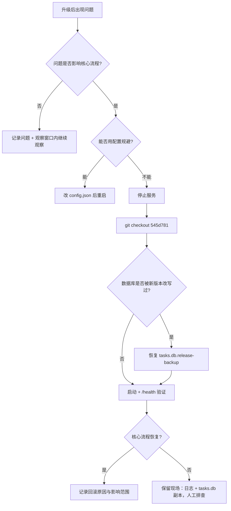

# 升级与回滚

> 回滚基线：`Stage-009 completed`（commit `545d781`）。
> 数据无 schema 变更历史：schema 一直是 **v2**（Stage-005 引入），
> 因此 v1.0.0 的升级与回滚**不需要数据迁移**。

---

## 1. 备份（升级前必做）

```powershell
cd E:\GitHub\MediaDock

# 1) 代码备份：记录当前提交与状态
git rev-parse HEAD
git status --short

# 2) 数据备份：数据库 + 配置 + 日志（下载文件可按需备份）
Copy-Item tasks.db tasks.db.release-backup -ErrorAction SilentlyContinue
Copy-Item config.json config.release-backup.json -ErrorAction SilentlyContinue
```

`core_store` 在执行数据库迁移前会自动生成 `tasks.db.bak`；
手工备份是第二层保险，命名建议带日期，例如 `tasks.db.20260920.bak`。

---

## 2. 升级步骤

```powershell
cd E:\GitHub\MediaDock

# 1) 备份（见上一节）

# 2) 停止正在运行的服务（端口被占用时新进程会以退出码 2 退出）
Get-CimInstance Win32_Process -Filter "Name='python.exe'" |
    Where-Object { $_.CommandLine -like '*server.py*' } |
    ForEach-Object { Stop-Process -Id $_.ProcessId }

# 3) 更新代码
git pull            # 或直接替换文件

# 4) 依赖与配置检查（退出码 0 才继续）
C:\Users\Administrator\Envs\mediadock\Scripts\python.exe -m pip install -r requirements.txt
C:\Users\Administrator\Envs\mediadock\Scripts\python.exe server.py --check-config

# 5) 发布门禁（静态 + 真实 HTTP 回归，退出码 0 才继续）
C:\Users\Administrator\Envs\mediadock\Scripts\python.exe tests\release_check.py

# 6) 启动并健康检查
C:\Users\Administrator\Envs\mediadock\Scripts\python.exe server.py
curl.exe http://127.0.0.1:8765/health
```

升级后还要做：

- 按 [userscript.md](userscript.md) 更新 `MediaDock.js`（比较 `/health.version.userscript`
  与脚本 `@version`）。
- 在页面上真实下载一个短视频，确认 `downloads/` 有产物且任务变为 `completed`。
- 打开 `/history` 确认旧记录仍在。

---

## 3. 回滚步骤

### 3.1 代码回滚

```powershell
cd E:\GitHub\MediaDock
Get-CimInstance Win32_Process -Filter "Name='python.exe'" |
    Where-Object { $_.CommandLine -like '*server.py*' } |
    ForEach-Object { Stop-Process -Id $_.ProcessId }

git checkout 545d781          # 回到 Stage-009 已签字基线
C:\Users\Administrator\Envs\mediadock\Scripts\python.exe server.py --check-config
C:\Users\Administrator\Envs\mediadock\Scripts\python.exe server.py
curl.exe http://127.0.0.1:8765/health
```

回滚后 `/health` 不再包含 `version` 字段，这是预期的（该字段由 v1.0.0 引入）；
前端会显示「服务未启动」以外的正常状态，只是不显示服务端版本号。
用户脚本建议同时回退到与旧服务端匹配的版本（否则面板会提示版本不一致）。

### 3.2 数据回滚

只有当数据库被新版本写入过、而你要回到旧版本的**旧库**时才需要：

```powershell
# 停止服务后执行
Copy-Item tasks.db.release-backup tasks.db -Force
```

注意：schema 版本 `2` 在 Stage-005 ~ v1.0.0 之间没有变化，因此正常情况下
**不需要**数据回滚，直接回代码即可继续使用同一个 `tasks.db`。

### 3.3 降级运行（不改变代码的软回滚）

| 目标 | 做法 | 结果 |
| --- | --- | --- |
| 用内置默认配置运行 | 重命名或删除 `config.json` | `/health.config.source = "defaults"` |
| 用临时配置诊断 | `server.py --check-config --config .\config.test.json` | 只读检查，不启动服务 |
| 不写数据库 | 让 `db_path` 指向不可用位置（如只读目录） | `/health.storage.kind = "memory"`、`degraded = true`，任务仍能跑但不持久化 |
| 换端口/换下载目录 | 改 `config.json` 的 `port`/`download_dir` 后重启 | 立即生效 |

### 3.4 前端回滚

Tampermonkey 中把脚本内容替换为旧版本源码并保存，然后刷新页面。
前端与服务端是松耦合的（只通过 HTTP API 通信），旧脚本配新服务端仍可用，
只是不会显示版本提示。

---

## 4. 回滚验收

回滚完成后逐项确认：

- [ ] `python server.py --check-config` 退出码 `0`。
- [ ] `/health` 返回 `status = "ok"`，`storage.kind = "sqlite"`，`degraded = false`。
- [ ] `/tasks` 能看到回滚前已有的任务；`/history` 能查到历史记录。
- [ ] 页面真实下载一个短视频成功（`completed` 且文件出现在 `downloads/`）。
- [ ] 暂停/继续/取消/重试按钮行为正常。
- [ ] 日志无新的 `error` 级别记录。

---

## 5. 回滚决策树


