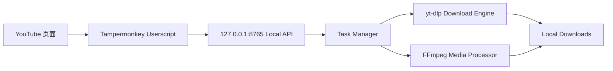
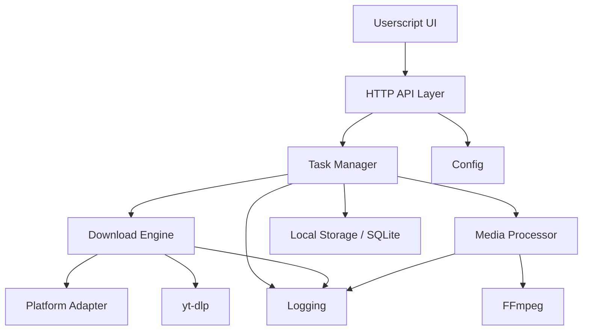
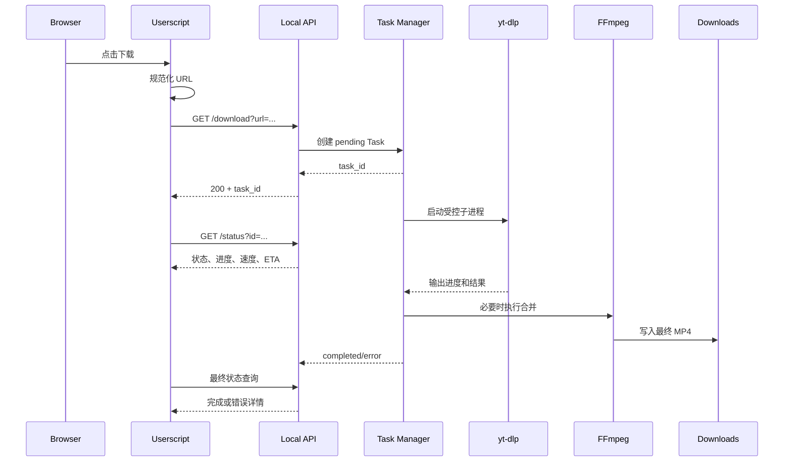
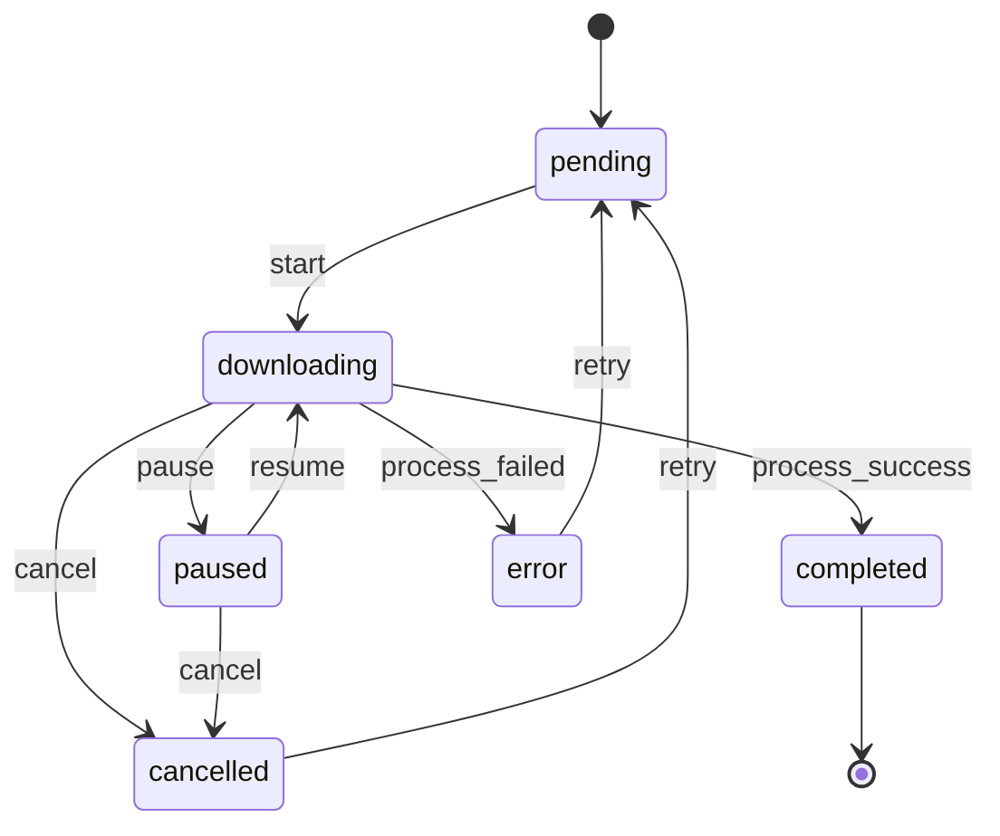
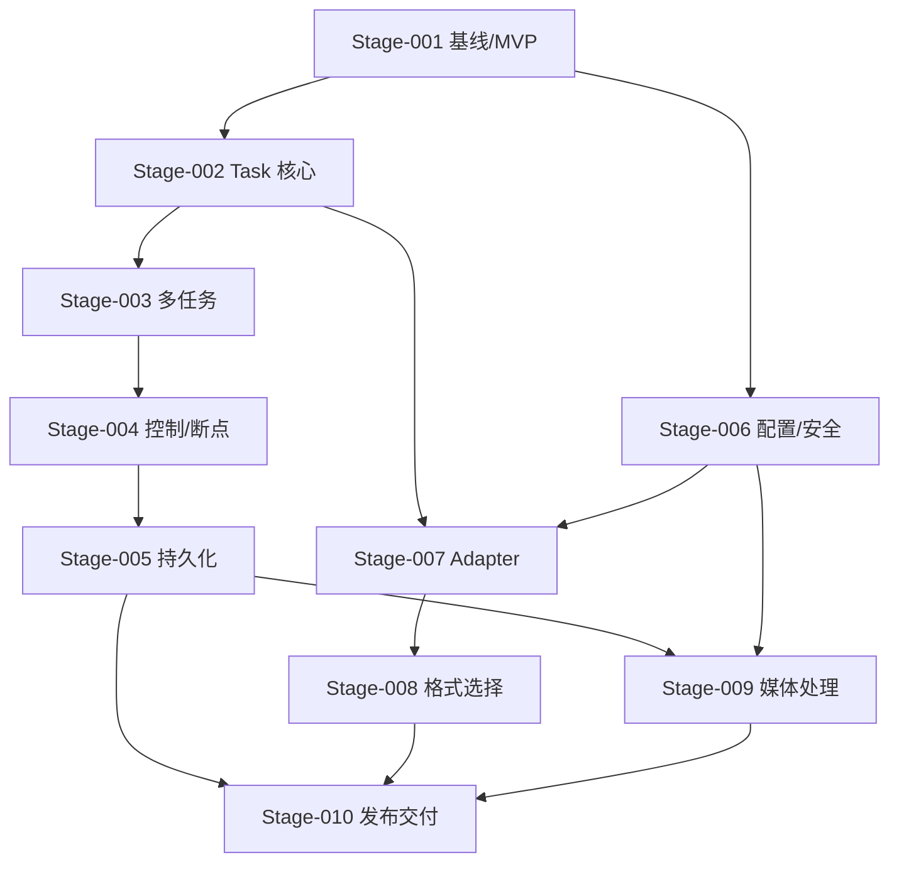
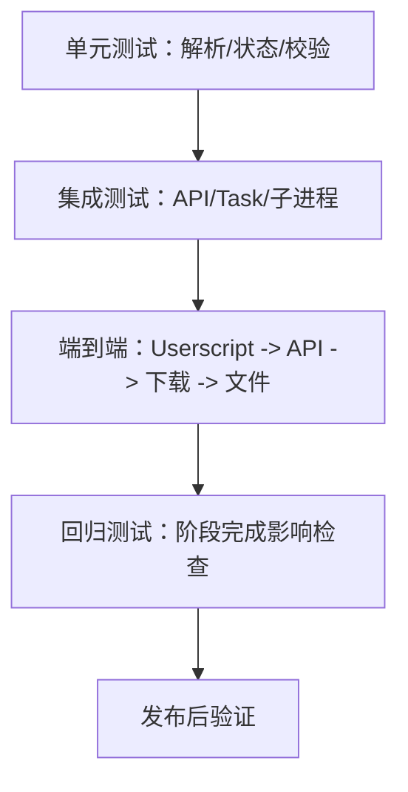

# MediaDock 全局开发计划

> 基于 [plan.md](plan.md)、[plan-agent.md](plan-agent.md) 以及当前代码现状生成。
>
> 本文件是全局主计划。后续每个阶段应从本文件拆分为独立文件，例如：
>
> - `Stage-001.md`
> - `Stage-002.md`
> - `Stage-003.md`
>
> 阶段文件只能细化本文件，不能在没有变更评估的情况下改变本文件已经确认的目标、接口、数据模型、状态或阶段依赖。

---

## 1. 计划元数据

- 计划名称：MediaDock Local Media Platform
- 计划文件：`plan-whole.md`
- 当前版本：`0.4`
- 当前状态：全部阶段已完成（Stage-001 ~ Stage-011），v1.0.1 已交付
- 计划负责人：[待填写]
- 最后更新时间：2026-09-20
- 当前阻塞：无（长期扩展候选见 `docs/release-notes.md`，需新阶段评估）
- 目标平台：Windows 本地环境
- 当前入口：Tampermonkey Userscript + Python Local HTTP Server

---

## 2. 需求与目标

### 2.1 产品目标

MediaDock 是一个运行在本地电脑上的媒体下载与处理平台：



核心定位不是重新实现视频网站下载，而是提供：

- 浏览器入口
- 本地任务调度
- 下载状态与控制
- 媒体处理
- 本地文件和任务管理

### 2.2 MVP 目标

第一交付目标是稳定完成：

```text
YouTube 页面
  -> 点击下载
  -> 本地 API 创建 Task
  -> yt-dlp 下载
  -> FFmpeg 合并为 MP4
  -> API 提供实时进度
  -> 页面显示进度、速度、ETA 和结果
```

MVP 不追求 4K、全平台、云端、账号管理、复杂格式选择或桌面应用。

### 2.3 长期目标

在不破坏 MVP 主流程的前提下，逐步扩展：

- 多任务下载
- 暂停、继续、取消
- 断点续传
- 任务持久化和历史
- 多平台 Adapter
- 动态格式选择
- Video to Audio
- 统一 Media Processor
- 字幕、封面和更多媒体处理
- 可替换的 Web、Electron 或本地 UI

---

## 3. 当前状态分析

### 3.1 当前代码基线

| 领域 | 当前实现 | 计划判断 |
| --- | --- | --- |
| 浏览器入口 | 根目录 `MediaDock.js`，YouTube 页面固定按钮 | 已有 MVP 入口，需要稳定化 |
| 本地服务 | 根目录 `server.py`，`ThreadingHTTPServer` | 已有可运行基础，需要拆分前先补测试 |
| 监听地址 | `127.0.0.1:8765` | 符合本地安全基线 |
| 下载引擎 | yt-dlp 子进程 | 已接入 |
| 媒体合并 | yt-dlp `--merge-output-format mp4`，依赖 FFmpeg | 已接入，需要明确依赖检测 |
| 任务模型 | 内存 `tasks = {}`，线程锁保护 | 单任务基础已有，多任务和持久化未完成 |
| 状态 | `downloading`、`completed`、`error` 实际已出现 | 需要向统一完整状态迁移 |
| API | `GET /health`、`GET /download`、`GET /status` | 已有 MVP API；控制 API 尚未实现 |
| 前端轮询 | 每秒查询 `/status?id=...` | 已有，当前只跟踪一个任务 |
| 配置 | 下载目录和 yt-dlp 候选路径写在 `server.py` | 后续迁移到配置系统 |
| 日志 | `MediaDock-server.log` 文件日志 | 已有，需要脱敏、分级和结构化改进 |
| 测试 | 未发现独立 `tests/` 目录 | Stage-001 必须建立最小测试基线 |
| 持久化 | 无 SQLite | 后续阶段实现 |
| 进程控制 | 无暂停、继续、取消接口 | 后续阶段实现 |

### 3.2 当前已知风险

1. `server.py` 将 HTTP、任务、下载、进度解析和配置集中在一个文件，继续扩展前需要先建立边界。
2. 进度正则依赖 yt-dlp 文本输出，HLS 分片下载时可能出现进度回退或估算变化，不能把每次百分比下降都当成错误。
3. 当前 `/download` 使用 GET 创建任务，后续控制接口需要统一请求方法、错误格式和兼容策略。
4. 当前任务只存在内存中，服务重启后任务记录消失，不能在持久化前承诺恢复正在运行的子进程。
5. 当前日志可能包含完整 URL 和命令信息，需要在安全阶段定义脱敏策略。
6. 当前下载路径、文件名和 yt-dlp 输出没有完整的路径边界验证，必须在扩展功能前补齐。
7. 当前前端只维护一个 `currentTaskId`，多任务阶段必须重做状态管理，而不是简单复制按钮逻辑。
8. 当前目录尚未按 `server/`、`core/`、`adapters/` 等建议目录拆分，拆分必须保留回滚路径。

---

## 4. 范围边界

### 4.1 本计划包含

- Windows 本地 Python Server
- Tampermonkey YouTube 入口
- yt-dlp 下载调度
- FFmpeg 合并和媒体处理
- Task 生命周期、进度、错误和日志
- HTTP API 演进
- 多任务、控制、持久化和历史
- 平台适配、格式选择和音频处理
- 测试、文档、配置、安全和发布回滚

### 4.2 明确不作为近期目标

- 云端下载
- 用户系统和账号管理
- Cookie 管理 UI
- 默认监听 `0.0.0.0`
- Docker
- 直接在浏览器端执行 yt-dlp 或 FFmpeg
- 一开始引入 Vue、Electron 或复杂 Web Framework
- 一开始提供所有视频网站和所有格式
- 在没有稳定任务模型前加入高级 FFmpeg 参数 UI

---

## 5. 总体架构和不变约束

### 5.1 分层架构



### 5.2 不变约束

1. Userscript 只负责页面入口、交互、请求和状态展示，不直接运行 yt-dlp 或 FFmpeg。
2. 本地 API 默认只监听 `127.0.0.1`。
3. 每次下载都是独立 Task，不设计全局单一下载状态。
4. 所有 Task 状态必须通过统一状态机改变，不能由 UI 直接修改状态。
5. 下载和媒体处理的实际执行必须在后端完成。
6. 路径、命令参数和外部进程必须由后端安全控制。
7. 任何阶段完成后都要检查对前置阶段和后续阶段的影响。
8. 后续阶段不得无记录地推翻已经确认的接口、数据模型或状态。
9. 任务列表排序、容量、折叠和滚动规则由本总计划统一定义，所有页面必须保持一致。

### 5.3 端到端主流程



---

## 6. 统一领域模型

### 6.1 Task 字段

第一版至少保留以下字段，后续持久化必须兼容这些字段：

```json
{
  "task_id": "a82f31c4",
  "type": "download",
  "status": "pending",
  "url": "https://www.youtube.com/watch?v=...",
  "platform": "youtube",
  "title": "",
  "percent": 0.0,
  "speed": "",
  "eta": "",
  "file_path": "",
  "error_code": "",
  "error_message": "",
  "created_at": "",
  "started_at": "",
  "updated_at": "",
    "completed_at": "",
    "completion_order": null
}
```

### 6.2 任务列表显示与排序契约

任务列表由后端提供全量任务，所有 YouTube 页面从同一个任务源刷新。前端不得只显示当前页面创建的任务，也不得依赖页面内存保存排序结果。

**排序规则：**

1. 未完成任务优先于已完成任务。
2. 未完成任务按当前 `percent` 从高到低排序，例如 `90% -> 80% -> 70%`。
3. `pending`、`paused`、`error`、`cancelled` 等没有有效实时进度的任务按 `0%` 参与未完成排序；同百分比时按 `created_at` 从新到旧排序。
4. 已完成任务按完成时间倒序排列，最近完成的排在最前面：第三完成的 -> 第二完成的 -> 第一个完成。
5. 已完成任务必须保留 `completed_at`，必要时使用单调递增的 `completion_order` 消除同一秒完成造成的排序歧义。

**显示规则：**

- 默认显示容量为 20 个任务。
- 未完成任务优先占用显示容量。
- 未完成任务数量超过 20 个时，不隐藏未完成任务；任务面板使用固定最大高度并允许内部滚动。
- 完成任务过多导致超出默认容量时，默认折叠为“已完成 N 个”，点击后展开完成任务列表。
- 未完成任务应尽量保持在页面可见区域，不能因为完成任务过多而被挤出首屏。
- 展开已完成任务后仍使用面板内部滚动，不能撑开页面遮挡 YouTube 主内容。
- 每个任务行显示可配置长度的标题，默认建议截取前 20 个字符并显示省略号。
- 每个下载中的任务显示百分比、实时速率和 ETA；等待、暂停、失败和完成任务显示对应状态文本。
- 排序、折叠和滚动只影响显示，不得删除或改变后端任务记录。

**刷新规则：**

- 任意页面创建、暂停、继续、删除或完成任务后，其他页面在下一次轮询时必须看到相同结果。
- 列表刷新时不能因排序变化导致任务控制按钮绑定到另一条任务。
- 任务状态更新后应保留稳定的 `task_id` 和 DOM 标识，避免整列表刷新造成误操作。

### 6.3 状态机



状态规则：

- `pending`：任务已创建但尚未开始执行。
- `downloading`：下载进程正在运行。
- `paused`：任务被控制为暂停，临时文件保留策略已明确。
- `completed`：最终文件已经生成并通过存在性检查。
- `error`：任务失败，必须有错误码或可读错误信息。
- `cancelled`：用户取消或系统明确终止，必须记录清理策略。

当前只允许实现已经能被测试证明的状态转换。不能先在 UI 中展示状态，再让后端以后补行为。

### 6.4 状态转换验收

| 当前状态 | 操作 | 允许结果 | 必须验证 |
| --- | --- | --- | --- |
| pending | start | downloading/error | 子进程和错误处理 |
| downloading | pause | paused/error | 进程控制和文件保留 |
| paused | resume | downloading/error | 断点续传 |
| downloading | cancel | cancelled/error | 终止和清理 |
| completed | pause/cancel | 拒绝 | 状态不被破坏 |
| error | retry | pending/downloading | 是否允许重试 |

---

## 7. API 演进基线

### 7.1 当前 MVP API

| 方法 | 路径 | 用途 | 当前状态 |
| --- | --- | --- | --- |
| GET | `/health` | 检查服务 | 已实现 |
| GET | `/download?url=...` | 创建下载任务 | 已实现，后续评估是否增加 POST |
| GET | `/status` | 查询全部任务 | 已实现 |
| GET | `/status?id=...` | 查询单个任务 | 已实现 |

### 7.2 后续控制 API

| 方法 | 路径 | 请求体 | 目标状态 |
| --- | --- | --- | --- |
| POST | `/pause` | `{ "task_id": "..." }` | paused |
| POST | `/resume` | `{ "task_id": "..." }` | downloading |
| POST | `/cancel` | `{ "task_id": "..." }` | cancelled |
| POST | `/retry` | `{ "task_id": "..." }` | pending/downloading |
| GET | `/formats?url=...` | 查询参数 | 返回可选格式 |

### 7.3 API 统一要求

- 成功和失败响应统一为 JSON。
- 错误至少包含 `error_code`、`message`，必要时包含 `task_id`。
- 找不到 Task 返回 404。
- 非法状态操作返回 409 或明确的业务错误码。
- URL、task_id、format_id 等输入必须验证。
- 每个 API 都要有请求示例、响应示例和错误示例。
- 新 API 不得破坏已有 MVP `/health`、`/download`、`/status`。

---

## 8. 阶段总览

阶段文件编号固定使用三位数，阶段完成后才允许进入下一个依赖阶段。阶段可以在影响评估后拆分，但不能静默合并或跳过验收。

| Stage | 名称 | 核心目标 | 主要产物 | 前置依赖 | 完成时间 |
| --- | --- | --- | --- | --- | --- |
| Stage-001 | 基线确认与 MVP 稳定化 | 让现有 YouTube 单任务流程可重复验证 | 测试基线、配置约束、MVP 验收结果 | 无 | 2026-09-19 |
| Stage-002 | Task 核心模型与后端边界 | 固化 Task 模型、状态和模块责任 | Task 模型、状态转换、后端模块边界 | Stage-001 | 2026-09-19 |
| Stage-003 | 多任务调度 | 支持多个独立下载任务 | 多任务 Task Manager、任务列表 API/UI | Stage-002 | 2026-09-19 |
| Stage-004 | 暂停、继续、取消与断点 | 完成进程控制和恢复 | 控制 API、状态控制、断点测试 | Stage-003 | 2026-09-19 |
| Stage-005 | 持久化与任务历史 | 服务重启后保留任务记录 | SQLite、迁移、历史查询 | Stage-004 | 2026-09-19 |
| Stage-006 | 配置、依赖与安全加固 | 提升可配置性和本地安全 | `config.json`、依赖检查、安全测试 | Stage-001，建议 Stage-005 后完善 | 2026-09-19 |
| Stage-007 | 平台 Adapter | 在不污染核心的情况下扩展平台 | Adapter 接口、YouTube Adapter、扩展预留 | Stage-002、Stage-006 | 2026-09-19 |
| Stage-008 | 格式选择与 Formats API | 支持动态格式选择 | `/formats`、格式模型、前端选择器 | Stage-007 | 2026-09-19 |
| Stage-009 | 音频模式与 Media Processor | 支持 Video to Audio 和统一媒体处理 | 媒体处理任务、MP3/M4A/WAV | Stage-005、Stage-006 | 2026-09-19 |
| Stage-010 | 发布、回归与长期扩展 | 固化交付、监控和后续扩展边界 | 发布包、文档、回滚方案、长期路线 | 全部必要阶段 | 2026-09-20 |
| Stage-011 | 单实例启动接管 | 启动时自动结束旧的 MediaDock 实例，无需手动排查端口占用 | `core_instance.py`、`--restart`、接管探针 | Stage-003、Stage-006、Stage-010 | 2026-09-20 |

> 完成时间 `-` 表示尚未完成；阶段完成后填写实际完成日期。

> `Stage-006` 的基础安全规则从 Stage-001 就必须执行；这里单列是为了集中完成配置系统和依赖诊断，不代表早期可以忽略安全。

---

## 9. 各阶段计划契约

以下内容是后续生成各 Stage 文件时必须继承的最小契约。每个 Stage 文件需要复制对应内容，并补充具体任务、真实文件路径、命令和测试结果。

### Stage-001：基线确认与 MVP 稳定化

**目标**：确认当前实现可以作为后续演进的可靠基线。

**进入条件**：

- 能启动 Python 3 环境。
- 可以确认 yt-dlp 和 FFmpeg 的实际可用路径。
- 可以访问一个允许测试的 YouTube URL，或准备等价的本地/模拟测试输入。

**任务**：

1. 运行并记录 `/health`、`/download`、`/status` 全链路。
2. 为 URL 校验、任务创建、状态查询、进度解析和错误处理建立最小自动化测试。
3. 确认 yt-dlp 格式表达式和 MP4 合并行为保持 `height<=1080` 的既定策略。
4. 验证服务重启后“可以重新创建下载任务”，但不把未实现的任务恢复误写成已支持能力。
5. 记录当前根目录结构与未来模块拆分的迁移边界。

**阶段输出**：

- MVP 基线测试结果。
- 当前 API 和 Task 字段快照。
- 已知失败场景清单。
- Stage-002 可直接使用的 Task 和 API 约束。

**验收门禁**：

- `/health` 返回 200 和 JSON `status=ok`。
- 合法 URL 能返回唯一 `task_id`。
- `/status?id=...` 能观察到状态和进度字段。
- 成功、无效 URL、服务缺失依赖和下载失败均有可识别结果。
- 现有 YouTube 按钮不因测试改动而失效。
- 所有已知限制被记录，不能把“重新下载”写成“任务恢复”。

**高影响决策门禁**：

- 是否继续兼容 `GET /download`，还是在后续增加 `POST /tasks`。
- 是否允许任务失败后重试，以及取消后临时文件的默认策略。
- MVP 的最低测试视频、网络和 FFmpeg 依赖条件。

### Stage-002：Task 核心模型与后端边界

**目标**：在不改变 MVP 外部行为的前提下，建立可支持多任务和控制的核心模型。

**输入契约**：Stage-001 的 API 快照、Task 字段、状态限制和失败场景。

**任务**：

1. 定义 Task 数据结构、状态枚举和合法状态转换。
2. 将任务管理、下载执行、进度解析、HTTP 路由和日志责任分开。
3. 保留当前 API 兼容层，避免重构直接破坏 Userscript。
4. 为任务查询、状态变更和错误转换建立测试。
5. 明确线程、子进程、锁和资源清理责任。

**输出契约**：稳定的 Task Manager 接口、状态机和错误模型。

**验收门禁**：

- 所有状态变化经过统一入口。
- 任务互不覆盖，`task_id` 唯一。
- 下载进程结束、异常和服务停止时资源可释放。
- 原有 `/health`、`/download`、`/status` 回归通过。

### Stage-003：多任务调度

**目标**：同时管理多个独立下载，不让一个任务覆盖另一个任务的状态。

**任务**：

1. 支持多个 Task 独立创建、运行、查询和完成。
2. 将并发上限固定为 3；第 4 个及之后的任务进入 `pending` 队列，并在运行槽位释放后按队列启动。
3. 将 Userscript 从单一 `currentTaskId` 改为全局任务集合和任务面板模型。
4. 增加全量任务、单任务和任务排序/显示所需的 API 契约，保证所有页面使用同一任务源。
5. 实现未完成任务按百分比降序、完成任务按完成时间倒序的稳定排序。
6. 实现默认最多显示 20 个任务；未完成任务超过 20 个时保留全部未完成任务并在固定面板内滚动。
7. 将超出显示容量的完成任务折叠为“已完成 N 个”，支持点击展开和再次折叠。
8. 标题长度可配置，默认按前 20 个字符截断并显示省略号。
9. 验证一个任务失败不影响其他任务，任意页面的任务变化都能同步到其他页面。

**验收门禁**：

- A、B、C 三个任务拥有独立 task_id、进度、状态和错误。
- 同时最多 3 个任务处于 `downloading`，第 4 个任务进入 `pending`。
- 任务完成后自动释放运行槽位，并按队列启动下一个等待任务。
- 未完成任务按 `percent` 降序显示，完成任务按 `completed_at`/`completion_order` 倒序显示。
- 默认容量为 20；未完成任务超过 20 个时不隐藏，并可在面板内滚动查看。
- 完成任务超出显示空间时默认折叠，点击后能够展开并查看完成顺序。
- 页面刷新或 YouTube SPA 导航不会把任务状态误归到当前视频。
- 任意页面新增、暂停、继续、删除任务后，其他页面刷新列表可看到一致状态。
- 多任务集成测试通过。

### Stage-004：暂停、继续、取消与断点

**目标**：围绕 yt-dlp 子进程实现真实控制，不用线程假暂停。

**任务**：

1. 定义 pause/resume/cancel/retry 的状态和错误语义。
2. 保存子进程句柄和控制上下文，保证只控制目标 Task。
3. 验证 Windows 下进程终止、子进程清理和无孤儿进程。
4. 明确 `.part`、`.ytdl` 和分片临时文件的保留/删除策略。
5. 验证暂停后继续使用已有数据，不从零开始。
6. 加入控制 API 和前端按钮，但按钮状态必须以服务端状态为准。

**验收门禁**：

- 下载中暂停可进入 `paused`。
- `paused` 继续可回到 `downloading`。
- 取消后进入 `cancelled`，不会错误显示 `completed`。
- 断点继续不会无意删除有效临时数据。
- 进程控制、文件清理和状态回归测试通过。

**高影响决策门禁**：

- 暂停的实现是终止并恢复，还是 Windows 进程挂起；默认优先选择可恢复的 yt-dlp 终止/重启方案。
- 取消后是否保留临时文件；建议默认保留可恢复文件，但必须防止脏文件污染最终结果。

### Stage-005：持久化与任务历史

**目标**：让任务记录在服务重启后可查询，并为后续恢复能力留出边界。

**任务**：

1. 引入 SQLite 数据库和版本化迁移。
2. 将 Task 元数据、状态事件或必要日志写入数据库。
3. 明确运行中任务在服务重启后的状态：默认标记为 `error` 或 `interrupted`，除非完成了真实恢复设计。
4. 增加历史查询、清理和错误处理。
5. 验证数据库损坏、写入失败和迁移失败的回滚策略。

**验收门禁**：

- 服务重启后已完成、失败、取消任务记录仍可查询。
- 数据库迁移可重复执行且版本明确。
- 未实现的进程恢复不被伪装成已实现。
- 数据备份和回滚步骤可执行。

### Stage-006：配置、依赖与安全加固

**目标**：集中处理路径、依赖、配置和本地安全。

**任务**：

1. 将下载目录、yt-dlp、FFmpeg、host、port、日志级别迁移到 `config.json` 或明确的配置层。
2. 提供 yt-dlp、FFmpeg、下载目录和磁盘空间检查。
3. 强制或验证 `127.0.0.1` 默认监听。
4. 校验 URL、task_id、format_id 和路径边界。
5. 禁止通过 HTTP 参数执行任意系统命令。
6. 对 URL、命令、文件路径和错误日志做敏感信息处理。
7. 增加配置缺失、配置错误和权限不足的诊断信息。

**验收门禁**：

- 配置错误可以在启动或健康检查时明确暴露。
- 下载文件始终位于允许的下载目录内。
- API 不接受任意命令或任意输出路径。
- 默认不暴露局域网。
- 安全和依赖测试通过。

### Stage-007：平台 Adapter

**目标**：把平台差异隔离在 Adapter 层，不把平台逻辑继续堆入 `server.py`。

**任务**：

1. 定义 `PlatformAdapter` 的匹配、信息获取和任务创建边界。
2. 先迁移 YouTube 现有流程，确保行为不变。
3. 增加 Platform Detector 和不支持平台的错误码。
4. 只有在单平台 Adapter 稳定后，再分别规划 TikTok、X、Instagram。
5. 为平台不可访问、需要登录或格式不同的情况保留明确错误。

**验收门禁**：

- YouTube 回归通过。
- 新平台代码不修改核心 Task 状态语义。
- 不支持 URL 被明确拒绝，不会错误调用不匹配的 Adapter。

### Stage-008：格式选择与 Formats API

**目标**：在默认稳定格式策略之上增加可查询、可验证的格式选择。

**任务**：

1. 设计 `/formats?url=...` 的请求、响应和错误模型。
2. 调用 yt-dlp 格式查询并解析为稳定内部模型。
3. 前端提供 Best、1080p、720p、480p、Audio 等选择。
4. 选定格式前验证格式仍可用，并防止传入任意命令参数。
5. 保留默认格式回退策略。

**验收门禁**：

- 查询结果字段稳定，格式不存在有明确错误。
- 选择格式不会破坏合并和最终文件检查。
- 未选择格式时仍使用已验证的 MVP 默认策略。

### Stage-009：音频模式与 Media Processor

**目标**：把音频提取和后续转码统一纳入后端媒体处理任务。

**任务**：

1. 定义媒体处理 Task 或统一 Task type。
2. 通过 API 调用 Media Processor，不让 UI 直接拼接 FFmpeg 命令。
3. 支持 MP3、M4A、WAV，并定义输入文件、输出路径和覆盖策略。
4. 验证 FFmpeg 失败、输入不存在、磁盘不足和格式不支持。
5. 为 Video to Audio 增加进度、状态和历史记录。

**验收门禁**：

- 视频可按选择格式生成目标音频。
- 原视频和输出音频的路径边界安全。
- 失败不会留下误标记为完成的文件。
- 媒体处理任务与下载任务的状态和错误模型一致。

### Stage-010：发布、回归与长期扩展

**目标**：形成可重复安装、验证、发布和回滚的交付流程。

**任务**：

1. 整理启动方式、依赖安装、配置说明和 Userscript 安装文档。
2. 建立全链路回归测试和最小发布检查。
3. 明确版本号、变更日志、升级步骤和回滚步骤。
4. 发布后观察日志、错误、核心流程和资源使用。
5. 根据真实使用反馈重新评估长期扩展，不在本阶段无计划地加入新平台或复杂 UI。

**验收门禁**：

- 新环境可以按文档启动服务并完成健康检查。
- 核心下载、状态、错误和回滚流程均通过。
- 发布后有观察窗口和异常升级规则。
- 已知限制和不支持场景被写入文档。

---

## 10. 阶段依赖和回溯规则



每个阶段完成时必须填写：

| 检查项 | 结论 |
| --- | --- |
| 对前置阶段是否有影响 | 无/具体影响 |
| 是否需要前置阶段回归测试 | 否/具体测试 |
| 对后续阶段是否有影响 | 无/具体影响 |
| 是否修改后续阶段文件 | 否/列出文件 |
| 是否修改总体计划版本 | 否/新版本号 |
| 是否允许进入下一阶段 | 是/否及原因 |

回溯规则：

1. 改变 Task 字段、状态或 API 时，至少重新检查 Stage-002 及其所有下游阶段。
2. 改变下载文件、临时文件或路径策略时，至少重新检查 Stage-004、Stage-005、Stage-006 和 Stage-009。
3. 改变平台入口或 URL 规则时，至少重新检查 Stage-001、Stage-007 和 Stage-008。
4. 改变 API 错误格式时，必须重新检查 Userscript、所有控制 API 和测试计划。
5. 影响范围不明确时，暂停后续开发，先完成影响评估。

---

## 11. 统一测试策略

### 11.1 测试层次



### 11.2 最低测试矩阵

| 类别 | 必测场景 |
| --- | --- |
| 环境 | Python、yt-dlp、FFmpeg 存在/缺失 |
| API | 健康检查、创建任务、查询全量、查询单任务、404、非法输入 |
| Task | 唯一 ID、状态转换、并发更新、异常终止 |
| 下载 | 正常下载、无效 URL、网络失败、视频不可访问、格式失败 |
| 文件 | MP4 合并成功、临时文件、路径边界、磁盘空间不足 |
| 控制 | 暂停、继续、取消、重试、断点续传 |
| 持久化 | 重启、迁移、数据库写入失败、历史查询 |
| 前端 | 按钮、轮询、错误显示、SPA 导航、多任务面板、跨页面同步 |
| 排序与显示 | 未完成百分比降序、完成时间倒序、默认 20 条、完成折叠、未完成超量滚动、标题截断 |
| 安全 | localhost 绑定、命令注入、路径遍历、日志敏感信息 |
| 发布 | 新环境启动、配置读取、回滚、发布后核心流程 |

### 11.3 阶段完成测试要求

每个 Stage 文件必须写清：

- 本阶段新增测试。
- 前置阶段回归测试。
- 受影响的后续阶段预检。
- 实际执行命令和输出摘要。
- 未能执行的测试及原因。
- 通过、失败、阻塞和遗留问题。

---

## 12. 关键决策记录

以下决策由 `plan.md` 已明确或当前实现已经形成；带“待确认”的决策必须在对应阶段门禁前完成。

| 编号 | 决策 | 状态 | 影响阶段 |
| --- | --- | --- | --- |
| D-001 | MVP 先做 YouTube 到 MP4，不先做全平台 | 已确认 | Stage-001 至 Stage-010 |
| D-002 | yt-dlp 负责下载，FFmpeg 负责媒体处理 | 已确认 | 全部 |
| D-003 | Userscript 与后端通过本地 HTTP API 解耦 | 已确认 | 全部 |
| D-004 | 默认监听 `127.0.0.1` | 已确认 | 全部 |
| D-005 | MVP 默认格式保持 `height<=1080` 的 MP4 策略 | 已确认 | Stage-001、Stage-008 |
| D-006 | 任务以独立 Task 表示，不使用单一全局下载状态 | 已确认 | 全部 |
| D-007 | 暂不引入 SQLite 到 MVP | 已确认 | Stage-001 至 Stage-004 |
| D-008 | 暂停实现优先采用 yt-dlp 可恢复的终止/重启方案 | 已确认（Stage-004 采用 terminates + 保留 `.part` + 重启复用） | Stage-004 |
| D-009 | 下载中的任务删除时停止进程并删除关联临时文件和输出文件；暂停/继续保留断点所需临时文件 | 已确认 | Stage-004、Stage-006 |
| D-010 | 是否长期兼容 GET `/download`，并何时增加 POST 创建任务 | 待确认 | Stage-001、Stage-002 |
| D-011 | 多任务最多 3 个并发，超出任务进入 pending 队列 | 已确认 | Stage-003 |
| D-012 | 服务重启后的运行中任务状态和是否自动恢复 | 已确认（Stage-005 采用：不自动恢复；`downloading`/`pending` → `error` + `error_code=interrupted`，`paused` 保持暂停） | Stage-005 |
| D-013 | 平台 Adapter 首批正式支持哪些平台 | 已确认：首批只正式支持 YouTube（`core_platform.DEFAULT_REGISTRY` 只注册 `YouTubeAdapter`）；其他平台显式拒绝 400 `unsupported_platform`；接新平台需 `ready=True` 的 Adapter 且单独评估鉴权 | Stage-007、Stage-008、Stage-010 |
| D-014 | 发布方式：手动启动、开机启动脚本或安装包 | 已确认（Stage-010 采用：手动启动 + 可选开机自启脚本，`docs/install.md` 给出启动文件夹与任务计划程序两种做法；不做安装包、不注册 Windows 服务，避免管理员权限与卸载残留） | Stage-001、Stage-010 |
| D-015 | 未完成任务按百分比降序，完成任务按完成时间倒序 | 已确认 | Stage-003、Stage-005 |
| D-016 | 默认最多显示 20 个；未完成超量不隐藏并允许面板滚动，完成任务超量默认折叠 | 已确认 | Stage-003 |
| D-017 | 完成/失败任务暂时保留，可手动删除；URL/video ID 去重后续扩展 | 已确认 | Stage-003、Stage-005 |
| D-018 | 单实例启动策略：同一端口只允许一个实例（继续关闭地址复用）；启动时若端口被本机 MediaDock 实例占用，则**接管**（结束该进程树 → 等待端口释放 → 重新绑定），占用者不是 MediaDock 时拒绝接管并保留退出码 2；另提供 `--restart` 主动接管 | 已确认（Stage-011 实现，`core_instance.take_over_port`） | Stage-003、Stage-011 |

---

## 13. 需求变更管理

新的需求不能直接追加到某个 Stage 文件。必须先判断：

1. 是局部任务调整，还是改变总体目标？
2. 是否改变接口、Task 字段、状态、路径、格式或安全边界？
3. 是否影响已完成阶段的验收？
4. 是否需要修改后续阶段的任务、顺序、依赖或测试？
5. 是否要升级 `plan-whole.md` 版本？

变更记录：

| 编号 | 变更内容 | 原因 | 影响阶段 | 影响等级 | 处理决定 | 计划版本 |
| --- | --- | --- | --- | --- | --- | --- |
| C-001 | [待填写] | [原因] | [Stage] | 高/低 | [新增/回溯/局部调整/拒绝] | [版本] |
| C-002 | Stage-004 新增 `paused`/`cancelled` 状态与 `POST /pause`、`/resume`、`/cancel`、`/retry`；`error`/`cancelled` 可重试；取消时删除本次运行的临时与输出文件 | 落实 D-008/D-009，并在提供控制 API 前先扩展状态机 | Stage-004（下游 Stage-005/006） | 低（Task 字段未新增，GET API 形状不变） | 局部调整，已写入 Stage-004.md 与 `docs/stage004-migration.md` | 0.2 |
| C-003 | 终态任务记录删除接口（`POST /delete`）不在 Stage-004 实现，Stage-004 由 `cancel` 承担「停止进程 + 删除文件」职责 | 避免在历史模型确定前引入第二个删除语义 | Stage-004、Stage-005 | 低 | 记录并推迟到 Stage-005 | 0.2 |
| C-004 | Stage-005 引入 SQLite（`tasks.db`、schema v2）、`GET /history`、`GET /events`、`POST /delete`，`/health`+`/tasks` 增加 `storage`；`interrupted` 用 `error_code` 表达而不新增状态；新增错误码 `invalid_limit`/`invalid_status`/`not_deletable` | 落实 Stage-005 任务与 D-012/D-017，并把重启语义固化为可测试契约 | Stage-005（下游 Stage-006/009/010） | 低（Task 字段与既有 API 形状不变） | 局部调整，已写入 Stage-005.md 与 `docs/stage005-migration.md` | 0.2 |
| C-005 | Stage-006 引入配置层（`core_config.py`/`config.json`）、依赖诊断（`core_deps.py`）、安全纯函数（`core_security.py`）；`/health` 增加 `config`+`dependencies`；新增错误码 `forbidden_host`(403)/`forbidden_origin`(403)/`payload_too_large`(413)；新增配置键 `max_active_tasks`（默认 3）与 `purge_keep`（默认 200）；`--check-config` CLI | 落实 Stage-006 任务与 D-004 强化、D-014 的本地启动检查，并把依赖与安全边界固化为可测试契约 | Stage-006（下游 Stage-007/008/009/010） | 低（Task 字段、状态机与既有 API 形状不变；默认值与 Stage-004/005 一致） | 局部调整，已写入 Stage-006.md 与 `docs/stage006-migration.md` | 0.2 |
| C-006 | Stage-007 引入平台层 `core_platform.py`（`PlatformInfo`/`PlatformAdapter`/`YouTubeAdapter`/`PlatformRegistry`/`DEFAULT_REGISTRY`/`detect_platform()`/`platform_names()`）；`server.py` 的 `/download` 改为「`validate_url`（由检测层代调用）→ `detect_platform` → `adapter.info` → `scheduler.submit(url, platform)`」且不再含平台字符串；新增错误码 `unsupported_platform`(400)/`platform_not_ready`(400)；D-013 决议为「首批只支持 YouTube」；既有 HTTP「正常下载」测试夹具 URL 从 `example.com` 迁移到 YouTube | 落实 Stage-007 任务 1-3：把平台判定收敛为单一真值，并把「不支持平台」从隐式失败升级为显式拒绝 | Stage-007（下游 Stage-008/009/010） | 低（Task 字段、状态机、状态集合、并发/文件策略与既有 API 形状不变；只新增 400 分支，并对未注册 host 的 URL 由 200 变为 400） | 局部调整，已写入 Stage-007.md 与 `docs/stage007-migration.md` | 0.2 |
| C-007 | Stage-008 引入格式层 `core_formats.py`（`PRESETS`、`resolve_preset`、`validate_format_id`、`selector_for`、`build_probe_command`、`parse_probe_output`、`build_formats_payload`、`FormatsProbe`）；新增 `GET /formats?url=`；`/download` 接受 `preset`/`format_id`（必须先查 `/formats`）；新增错误码 `invalid_format`(400)/`format_not_available`(400)/`formats_unavailable`(502)；`TaskControl.format_expr` + `Scheduler` 发送期格式记录（**不新增 Task 字段、无 schema 变更**）；`MediaDock.js` 5.1 增加清晰度下拉 | 落实 Stage-008 任务 1-5：把格式选择固化为「固定预设表 + 探测结果校验 + 服务端拼装 argv」，并保持默认策略不变 | Stage-008（下游 Stage-009/010） | 低（Task 字段、状态机、状态集合、并发/文件策略、平台检测与既有 API 形状不变；不带格式参数的请求路径完全不变） | 局部调整，已写入 Stage-008.md 与 `docs/stage008-migration.md` | 0.2 |
| C-008 | Stage-009 引入媒体处理层 `core_media.py`（`TARGETS`、`resolve_target`、`build_ffmpeg_command`、`output_path_for`、`find_source_file`、`parse_media_line`、`has_free_space`、`AudioProcessor`）；新增 `GET /audio`（目标表）与 `POST /audio?target=mp3|m4a|wav`（由已完成的下载任务创建 `type="audio"` 任务）；新增错误码 `invalid_audio_target`(400)/`not_a_download_task`(409)/`source_not_found`(404)/`source_outside_download_dir`(400) 与任务级 `ffmpeg_missing`/`ffmpeg_failed`/`output_missing`/`insufficient_space`；`TaskManager.create(task_type=)`、`Scheduler.submit/admit(media_job=)`、`TaskControl.media_job`、`server.task_engine()` 分流 | 落实 Stage-009 任务 1-5：把音频转换纳入与下载完全相同的 Task 状态机、控制接口、并发上限、存储与历史；目标名是唯一可从 HTTP 传入的转换参数 | Stage-009（下游 Stage-010） | 低（Task 字段、状态集合、存储 schema、API 错误格式、并发/文件策略与既有路由形状不变；无 `media_job` 的路径完全不变） | 局部调整，已写入 Stage-009.md 与 `docs/stage009-migration.md` | 0.2 |
| C-009 | Stage-010 引入发布层 `core_release.py`（`APP_VERSION="1.0.0"`/`API_VERSION="1"`/`USERSCRIPT_VERSION="5.2"`、文档清单、变更日志解析、`config.example.json` 键对齐、`release_info()`）；`/health` 新增 `version {app, api, userscript, schema}`；新增发布门禁 `tests/release_check.py`（静态 + 真实 HTTP 全链路 + 重启 + 回滚演练 + 安全守卫，60 项）与 `tests/test_release.py`（27 用例）；`MediaDock.js` 5.2（显示服务端版本 + 版本不一致提示）；新增 `README.md` 与 7 份交付文档；D-014 决议为「手动启动 + 可选开机自启脚本」 | 落实 Stage-010 任务 1-5：形成可重复安装、验证、发布和回滚的交付流程，并把版本号收敛为单点真值 | Stage-010（收口全部阶段） | 低（`/health` 仅新增增量字段；Task 字段、状态机、存储 schema、排序与显示契约、既有 API 与错误码全部不变；无新增第三方依赖） | 局部调整，计划版本升级为 `0.3`，已写入 Stage-010.md 与 `docs/stage010-migration.md` | 0.3 |
| C-010 | Stage-011 新增 `core_instance.py`（`PortOwner`/`find_port_owner`/`kill_process_tree`/`port_is_free`/`wait_port_free`/`take_over_port`，五态结论 free/killed/foreign/unknown/failed）；`server.py` 抽出 `bind_server()`/`free_port_for_start()`，新增 `--restart` 与未知选项校验，绑定失败时自动接管并重试一次；版本 `1.0.0 → 1.0.1`；D-018 决议为「单实例 + 启动接管」 | 落实用户诉求「每次启动先杀掉之前存在的实例」，同时避免误杀非 MediaDock 进程 | Stage-011（下游无） | 低（HTTP 契约、Task 字段、状态机、存储 schema、排序与文件策略全部不变；仅新增命令行选项与启动期进程管理） | 局部调整，计划版本升级为 `0.4`，已写入 Stage-011.md 与 `docs/stage011-migration.md` | 0.4 |

高影响变更必须在继续开发前更新 `plan-whole.md` 和受影响的 Stage 文件。低影响变更可以在 Stage 文件中记录，但不能改变总体契约而不升级版本。
---

## 14. Stage 文件生成规则

后续生成 `Stage-001.md`、`Stage-002.md` 等文件时，每个文件必须包含：

1. 本阶段在 `plan-whole.md` 中的原始目标和版本。
2. 进入条件、负责人、状态和当前阻塞。
3. 输入契约、输出契约和不变约束。
4. 具体任务，包含真实文件、模块、接口和命令。
5. 阶段验收标准，尽量量化。
6. 单元、集成、回归、端到端和安全测试。
7. 风险、依赖、回滚和替代方案。
8. 实际输出与计划差异。
9. 阶段完成时对前置和后续阶段的影响检查。
10. 阶段结束记录：是否允许进入下一阶段。
12. 如果涉及任务列表，必须包含排序、默认显示上限、完成任务折叠、未完成任务超量滚动和跨页面同步测试。

Stage 文件不能：

- 重新设计已经确认的整体架构而不更新总计划。
- 把未来阶段的功能混入当前阶段。
- 把未验证的行为写成已完成。
- 跳过前置阶段回归测试。
- 因为局部实现方便而破坏 API、Task 或状态契约。

---

## 15. 首批 Stage 文件建议

建议按以下顺序创建：

1. `Stage-001.md`：基线确认与 MVP 稳定化
2. `Stage-002.md`：Task 核心模型与后端边界
3. `Stage-003.md`：多任务调度
4. `Stage-004.md`：暂停、继续、取消与断点
5. `Stage-005.md`：持久化与任务历史

Stage-006 至 Stage-010 在前五个阶段的接口和状态稳定后再拆分，避免过早为未来功能制造大量文件。

---

## 16. 全局交付标准

只有满足以下条件，才认为本计划范围内的工作完成：

- [x] MVP 主流程可重复执行。
- [x] Task 模型、状态和 API 契约有单一来源。
- [x] 每个已完成阶段都有阶段验收和影响检查记录。
- [x] 受影响的前置阶段已经完成回归测试。
- [x] 后续阶段计划已经根据实际输出同步更新。
- [x] 正常、边界、异常、兼容性和安全测试有结果记录。
- [x] 未完成任务按百分比降序，完成任务按完成时间倒序。
- [x] 默认最多显示 20 个任务，未完成任务超量时可滚动查看。
- [x] 完成任务过多时默认折叠，并可以展开查看完成顺序。
- [x] 所有打开的 YouTube 页面看到一致的任务列表和状态。
- [x] 配置、依赖、日志、数据、迁移和回滚有明确说明。
- [x] 发布后验证和问题升级流程可执行。
- [x] 已知限制和未完成能力没有被写成已支持能力。

### 16.1 验收证据（2026-09-20 复核）

| 交付标准 | 证据 |
| --- | --- |
| MVP 主流程可重复执行 | `tests/probe_chain.py`、`tests/probe_persist.py` 走真实 HTTP+调度链路；`tests/release_check.py` 运行期 60 项全通过 |
| Task 模型/状态/API 单一来源 | `core_task.py` + `core_manager.py` 状态机 + `plan-whole.md` §6；`tests/test_task.py`、`tests/test_manager.py`、`tests/test_apiv2.py` |
| 阶段验收与影响检查记录 | `Stage-001.md` ~ `Stage-010.md` 各含「阶段验收标准 / 阶段衔接检查 / 阶段完成影响检查 / 阶段完成签字」 |
| 前置阶段回归测试 | 每阶段完成时执行全量单测 + 全部探针；最终 `ran=355 fail=0 err=0`，9/9 探针 rc=0 |
| 后续阶段计划同步更新 | 各 Stage 文件「实际输出与计划差异」+ 本文件 §13 变更记录 C-002 ~ C-009 |
| 正常/边界/异常/兼容/安全测试记录 | `ran=355 fail=0 err=0`；9 个探针（含真实 FFmpeg、真实进程终止、越界路径、真实端口接管）；`tests/release_check_result.json` |
| 任务排序契约 | `core_listing.py` + `tests/test_listing.py`；发布检查 `tasks.order_*` |
| 默认 20 条 + 未完成超量滚动 | `MediaDock.js` `MAX_VISIBLE_ROWS = 20` + 面板内部滚动；`tests/check_userscript.py` 锚点校验 |
| 完成折叠/展开 | `MediaDock.js` `makeCompletedToggle`（`mediadock-completed-toggle` 锚点） |
| 多页面一致任务列表 | 服务端 `/tasks` 为唯一数据源，所有页面同一轮询；`tests/probe_multi.py` 覆盖共享列表。**浏览器多标签实测列入 `docs/release-checklist.md` 人工项** |
| 配置/依赖/日志/数据/迁移/回滚说明 | `docs/configuration.md`、`docs/install.md`、`docs/upgrade-rollback.md` |
| 发布后验证与升级流程 | `docs/release-checklist.md` §3 观察窗口、§4 异常升级规则、§5 发布记录模板 |
| 已知限制未写成已支持 | `docs/known-limitations.md`（平台/格式/媒体/任务/安全/前端/诊断 7 类） |

> 复核结论：本计划范围内工作全部完成。仍未完成的只有**需要人工在浏览器/真实网络上确认**
> 的验收项，已集中列在 `docs/release-checklist.md` 第 2 节，不作为代码遗留。

---

## 17. 当前第一步（已执行完毕，保留为历史记录）

本计划启动时的第一步不是立即开发多平台或复杂 UI，而是生成并执行 `Stage-001.md`：

1. 记录当前代码和 API 基线。 → 已完成（`docs/stage001-baseline.md`）
2. 补齐最小测试结构。 → 已完成（`tests/` 建立，最终 335 个用例）
3. 验证 YouTube 单任务端到端流程。 → 已完成（`tests/probe_chain.py`）
4. 确认 yt-dlp、FFmpeg、路径、日志和错误边界。 → 已完成（Stage-001/006）
5. 完成 Stage-001 的前后影响检查。 → 已完成（`Stage-001.md` §11/§12）
6. 只有验收通过后，才生成或执行 `Stage-002.md`。 → 已按此规则推进到 Stage-010

### 17.1 当前状态与下一步

- 当前状态：Stage-001 ~ Stage-011 全部完成，v1.0.1 已交付（见 §16.1 验收证据）。
- 下一步不在本计划范围内。若要继续演进，必须先做需求评估并新增阶段文件，
  候选方向见 `docs/release-notes.md` 的「下一步候选」（第二批平台、字幕/缩略图、
  清晰度写入历史、安装包等），不得直接在本计划末尾追加实现任务。
